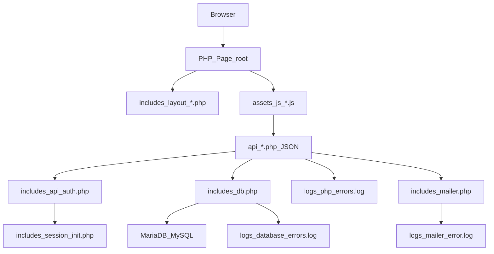
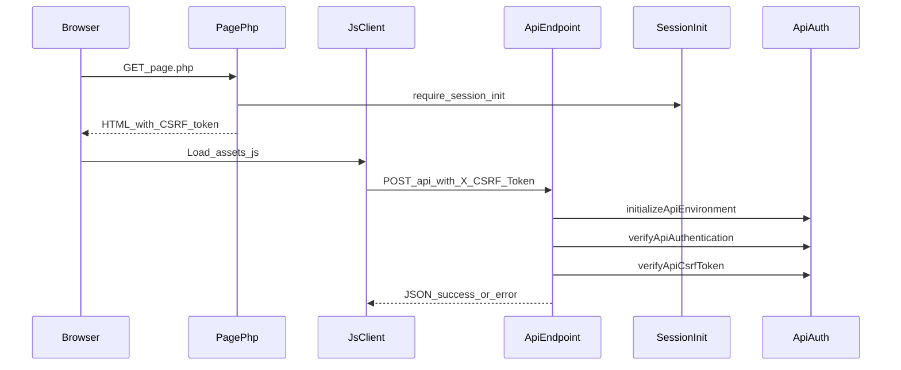

# CollaboraNexio — Contesto “Start Here” per nuovi agent

Questo documento è pensato per **dare contesto rapido e completo** a chi entra nel repo per la prima volta (agent/collega) e deve capire **cosa fa la piattaforma oggi**, **com’è organizzata**, e **dove mettere le mani** senza perdere giorni.

---

## 2026-01-12 — WIP: AI Copilot / Raccolta dati + RAG (multi-tenant)

Obiettivo:
- Aggiungere un **AI Copilot multi‑tenant** integrato con compliance (entry point anche da planning) per raccolta dati + gap analysis con RAG, senza impattare planning/tenant 28.

### Implementazione (in corso)
- **DB (nuove tabelle)**: migrazione `database/migrations/67_tenant_ai_onboarding.sql`
  - `tenant_doc_index_runs`, `tenant_doc_chunks`, `tenant_doc_files_state`
  - `tenant_ai_chat_sessions`, `tenant_ai_chat_messages`
  - `tenant_checklists`, `tenant_checklist_items`, `tenant_checklist_item_values`
  - `tenant_ai_settings` (paths indicizzabili + esclusioni)
- **Tool apply**: `tools/apply_migration_67_tenant_ai_onboarding.php`
- **Indicizzazione tenant**: `includes/ai/tenant_docs_indexer.php`
  - estrazione testo (docx/xlsx/txt/pdf best‑effort)
  - chunking + redazione PII (email/telefono/CF)
- **Endpoint AI (onboarding attuale)**:
  - `api/ai/tenant_docs_snapshot.php`
  - `api/ai/tenant_docs_reindex.php`
  - `api/ai/tenant_docs_analyze.php`
  - `api/ai/tenant_checklists.php` (templates/get/update/export XLSX)
- **Worker cron**: `cron/tenant_docs_reindex.php` (throttle 10 min)
- **Chat onboarding**: esteso `api/ai/chat.php` con `mode=onboarding` (RAG + azioni whitelist)
- **Richieste nuove in arrivo (da implementare)**:
  - endpoint RAG dedicati (`api/ai_rag_query.php`, `api/ai_rag_reindex.php`)
  - nuove tabelle `ai_doc_chunks` / `ai_doc_index_jobs` + conversazioni Copilot
  - integrazione checklist con endpoint già presenti (`api/checklist_*`)
  - entry point Copilot in `planning.php`
- **UI compliance**:
  - `compliance.php` nuovo modal “Assistente AI”
  - `assets/js/compliance_onboarding.js` (chat + checklist tabellare)
  - `assets/css/compliance.css` (layout)
- **Template checklist**:
  - `configs/checklists/generic_gap_assessment.json`
  - `configs/checklists/iso9001_iso7101_health.json`
- **Compliance AI guardrail**:
  - `assets/js/compliance.js`: campo obbligatorio `document_objective`
  - `api/compliance/artifact_ai.php`: blocco generazione se obiettivo mancante + include checklist + tenant_doc_chunks nel prompt

### Test plan rapido (parziale)
- Applica migrazione 67: `tools/apply_migration_67_tenant_ai_onboarding.php`
- `compliance.php` → “Assistente AI”:
  - stato indicizzazione visibile
  - reindex + analyze senza blocchi
  - crea checklist da template e compila
  - chat aggiorna checklist (status/note)
- Wizard compliance: “Obiettivo documento” obbligatorio prima di AI/applica

## 2026-01-17 — COMPLETATO: “Catalogo servizi/norme 2026” + Engine Stima (Planning tenant 28)

### Implementazione (cosa è stato fatto)
- **DB (catalogo)**: aggiunte colonne additive su `consulting_activity_types`:
  - `scheme_type` (VARCHAR(30) NULL)
  - `legacy_combo` (TINYINT(1) NOT NULL DEFAULT 0)
- **Seed tenant 28 (ATOMICI)**:
  - aggiornato seed servizi/norme con **range base ridotti** (target ~**20%** dei range precedenti) e `scheme_type` 2026
  - i servizi combo legacy vengono mantenuti ma marcati `is_active=0` + `legacy_combo=1` (e `is_legacy_composite=1` se colonna presente)
  - **peso e call cadence** derivati dalla complessità (vedi sotto)
- **UI Catalogo** (`planning.php` / `assets/js/planning.js`):
  - rinominato in **“Catalogo servizi / norme (parametri)”**
  - badge `scheme_type` e badge **LEGACY**
  - filtro “Solo attivi” continua a nascondere legacy/inattivi; disabilitandolo si vedono anche legacy/inattivi
- **Wizard stima**:
  - Step 2: toggle **“Mostra LEGACY”** (di default nascosti, ma non rompe piani/bozze che li hanno già selezionati)
  - warning + bottone **“Converti in servizi atomici”** (mapping statico + fallback split su `_`)
  - suggerimento **EMAS → aggiungi ISO 14001**
  - Step 3: aggiunti blocchi condizionali avanzati (Food / ISO17025 / CE / GDPR / ODV231 / Accreditamenti)
  - Step 4: aggiunta **anteprima attività** che verranno generate (per fasi) già in schermata stima
  - Step 4: modificabili manualmente **giornate on-site / remoto** (una modifica aggiorna subito l’altra) + preview riallineata
  - Step 4: per coerenza preview ↔ backend, la UI usa le fasi `preview_phases` restituite da `estimate_days.php` (workplan server, fallback su default phases)
- **Engine stima** (`api/consulting_plans/estimate_days.php`):
  - algoritmo **deterministico** con fattori (intervento, maturità, dipendenti, siti, sedi on-site, regolamentato, driver avanzati)
  - output: `suggested_days`, `range`, `breakdown on-site vs remoto`, `confidence` + `rationale`
  - include anche `preview_phases` per ogni servizio (per costruire in UI una preview identica alla generazione attività)
  - sinergia multi-servizio controllata (max 20% discount base, applicata solo a quota comune per `scheme_type`)
  - AI enrichment opzionale/best-effort (±20%) senza bloccare la stima

### Mapping Complessità → Peso / Call (catalogo)
- **Peso (`weight_factor`)**: complessità 1 ⇒ 1.00 … complessità 5 ⇒ 1.50 (lineare)
- **Call ogni (`call_every_days_default`)**: complessità 1 ⇒ 90gg … complessità 5 ⇒ 30gg (lineare)

### Migrazione / tool
- **SQL**: `database/migrations/60_consulting_activity_catalog_scheme_type_legacy_combo.sql`
- **Apply tool**: `tools/apply_migration_60_consulting_activity_catalog_scheme_type_legacy_combo.php`

### File toccati (principali)
- `planning.php`
- `assets/js/planning.js`
- `api/consulting_plans/activity_types.php`
- `api/consulting_plans/estimate_days.php`
- `database/migrations/60_consulting_activity_catalog_scheme_type_legacy_combo.sql`
- `tools/apply_migration_60_consulting_activity_catalog_scheme_type_legacy_combo.php`

### Test plan (click-by-click)
- Applica migrazione 60: `tools/apply_migration_60_consulting_activity_catalog_scheme_type_legacy_combo.php`
- Seed catalogo tenant 28 (Admin/Super Admin):
  - da UI catalogo oppure chiamando `POST api/consulting_plans/activity_types.php` con `{"action":"seed_services","csrf_token":...}`
- `planning.php` → apri **Catalogo servizi / norme (parametri)**:
  - verifica badge `scheme_type` e badge **LEGACY** sui record legacy
  - disattiva “Solo attivi” per vedere legacy/inattivi
- `planning.php` → wizard “Stima giornate”:
  - Step 2: per default legacy nascosti; abilita “Mostra LEGACY” per visualizzarli
  - seleziona un servizio legacy combo → compare warning + bottone “Converti”
  - seleziona **EMAS** senza ISO14001 → compare suggerimento “Aggiungi ISO 14001”
  - Step 3: seleziona servizi Food / ISOIEC17025 / CE / PRIVACY / ODV231 / ACCRED → deve comparire il relativo blocco avanzato
  - Step 4: “Calcola stima” → deve mostrare breakdown on-site/remoto, confidenza e motivazione; `intervention_type` è **obbligatorio** (se mancante → errore 400), `qms_maturity` resta consigliato (se mancante → confidenza cap 65%)
  - Step 4: deve comparire **“Attività proposte (anteprima)”** con fasi (Kickoff/GAP/Documentazione/…)
  - Multi-servizio: seleziona 2+ servizi `scheme_type` (es. ISO9001 + ISO14001) → in `integration_notes` deve comparire la sinergia applicata (se significativa)

### Note compatibilità / fallback
- Se migrazione 60 non è applicata: UI/API funzionano comunque (feature detection), ma `scheme_type/legacy_combo` non saranno disponibili.
- I servizi legacy combo non vengono eliminati (compatibilità piani storici); nel wizard sono marcati e convertibili in atomici.

## 2026-01-17 — AGGIUNTO: Prezziario default + KM trasferta (multi-sede) + Fix bozza calendario (Planning tenant 28)

### Implementazione (cosa è stato fatto)
- **Prezziario (default)**:
  - `day_rate` default: **360 €/giorno** (fallback automatico se il catalogo ha `default_day_rate=0`)
  - `fixed_amount` default: **vuoto/0** (nessun default)
  - `km_rate` default: **0.50 €/km**
- **Multi-sede + KM trasferta**:
  - aggiunto campo opzionale su `consulting_plan_items`: `location_tenant_location_id` (per agganciare l’attività ad una specifica sede `tenant_locations.id`)
  - UI `planning.php` (tab Attività): per attività **on-site** e **trasferta** compare selettore **“Sede attività”**
  - per attività `travel`: se **KM=0** (e sono selezionati **Consulente** + **Sede**), al salvataggio viene calcolata automaticamente la distanza A/R (best-effort, no API esterne)
- **Bozza calendario**:
  - `api/consulting_plans/schedule_generate.php` ora usa vincoli **hard** (no overlap con eventi reali + bozze/confirmed). Se non trova slot nella finestra, ritorna **409** con dettaglio e suggerisce di ampliare la finestra/cambiare consulente.
  - su `intervention_type=recertification` prova a posizionare “Audit interno / Riesame / Supporto audit esterno” verso la **fine periodo** (best‑effort) se non ci sono date fisse.

### Migrazioni / tool
- **SQL**: `database/migrations/61_consulting_plan_items_locations.sql`
- **Apply tool**: `tools/apply_migration_61_consulting_plan_items_locations.php`

### File / risorse toccate (principali)
- `assets/js/planning.js`
- `api/consulting_plans/items_upsert.php`
- `api/consulting_plans/items_generate_from_estimate.php`
- `api/consulting_plans/activity_types.php`
- `api/consulting_plans/schedule_generate.php`
- `includes/locations_distance.php`
- `includes/data/province_centroids_ddmmss.csv` (dataset offline: centroidi province, convertiti da DMS a decimali)

### Note KM (come funziona)
- **Nessuna dipendenza esterna runtime**: KM stimati con dataset offline `province_centroids_ddmmss.csv`.
- **Stima**: distanza geodetica tra centroidi di provincia × `roadFactor=1.25`, poi **A/R** (×2), arrotondata a 0.1 km.
- **Provincia consulente**:
  - preferibile inserire `home_city` come `Città (PR)` (es. `Milano (MI)`) per evitare ambiguità
  - fallback: prova a inferire la provincia da `italian_municipalities` se presente e univoca

### Test plan rapido
- Applica migrazione 61: `tools/apply_migration_61_consulting_plan_items_locations.php`
- `planning.php` → seleziona un piano → tab **Attività**:
  - crea/modifica una riga `Trasferta`
  - seleziona **Consulente** + **Sede attività**
  - lascia **KM=0** → **Salva** → al reload deve comparire KM calcolato e totale aggiornato
- `planning.php` → tab **Calendario (bozza)**:
  - click **Genera proposta** → deve creare slot (se ci sono finestre libere nel calendario dei consulenti)

## 2026-01-17 — AGGIUNTO: Calendario (bozza) a FASI + Workplan per servizio (Planning tenant 28)

Obiettivo:
- Rendere “Calendario (bozza)” **sensato e spiegabile** introducendo un modello a **FASI** (`phase_key/phase_order`) e un **workplan per servizio** (task predefiniti + distribuzione giorni).

### Implementazione (cosa è stato fatto)
- **Config (nuovo)**:
  - `configs/scheduling/phase_library.php`: libreria fasi (`phase_key` → `order` + `label`)
  - `configs/scheduling/service_workplans.php`: workplan per `service_code` (task con `phase_key/order`, `client_blocking`, `merge_key`, distribuzione per `intervention_type`)
- **DB (migrazione additiva)**:
  - aggiunte colonne opzionali su `consulting_plan_items`:
    - `phase_key` VARCHAR(40) NULL
    - `phase_order` INT NULL
    - `client_blocking` TINYINT(1) NULL
    - `merge_key` VARCHAR(40) NULL
- **Generazione attività (wizard stima → crea attività)**:
  - `api/consulting_plans/items_generate_from_estimate.php` ora usa `service_workplans.php` (se presente) per creare le attività del piano già “a fasi”
  - **granularità giornate**: per attività day-based (onsite/remote/travel) usa solo step **0.5** (vietato 0.25)
  - le task `call/communication` vengono create come **durata in ore** (`hours`, `days=0`) da **30–60 min** (split se necessario) e **non “consumano”** le giornate day-based
  - feature detection: se migrazione 62 non è applicata, continua a generare attività senza i nuovi campi (no 500); lo scheduling usa fallback da descrizione `Fase: ...`
- **Calendario proposto (bozza)**:
  - `api/consulting_plans/schedule_generate.php` schedula **sequenzialmente per fase** (ordine `phase_order` + buffer `min_gap_days`, default 3 giorni)
  - preferisce `consulting_plan_items.phase_key/phase_order` (migrazione 62) e usa fallback euristico su title/descrizione se mancanti
  - converte `days/hours` in slot realistici:
    - **day-based**: blocchi da **mezza giornata (4h)** ripetuti (0.5d = 240m)
    - **call/communication**: **30–60 min** (clamp), con `call-day` considerato come **4h** per conversioni legacy
  - `merge_key`: best-effort merge cross-servizio (es. kickoff/audit) per ridurre duplicazioni
  - `client_blocking`: blocco overlap “client-side” best-effort (sovrapposizione vietata se uno dei due slot è blocking)
  - finestra bozza **default 30 giorni** se `period_end` è vuoto (evita sparpagliamento annuale)
  - avvisi non bloccanti (es. ottimizzazione trasferte disattivata) vengono restituiti in `meta_warnings` (se presenti)
  - vincolo hard: se non trova slot liberi nella finestra, ritorna **409** (nessun “FORZATO”)
- **Modifica slot (UI)**:
  - `planning.php` tab “Calendario (bozza)”: aggiunte colonne **Fase** e **Reason**
  - `assets/js/planning.js`: mostra fase/reason da `explain_json` (migrazione 53) con fallback su parsing “Fase:” dal titolo + blocca salvataggio lato client se overlap non permesso (best-effort)
  - `api/consulting_plans/schedule_update.php` + `schedule_suggest.php`: enforcement overlap blocking (schema drift safe su `explain_json`)
- **UI Attività (durata call)**:
  - `planning.php` tab “Attività & Costi”: colonna **Durata** (day-based in gg; call/communication in minuti) per evitare righe “0.00 gg”
  - `api/consulting_plans/items_upsert.php`: normalizza `days` a step 0.5 e clamp call a 30–60 min (best-effort, ritorna `warnings`)
- **Fix AI (allocazione consulenti)**:
  - `api/consulting_plans/allocation_suggest.php`: schema `response_format` compatibile con **OpenAI strict JSON schema** (evita errori tipo “Invalid schema … Extra required key …”)
    - output AI usa una lista `assignments[] = {item_id,user_id}` (non map con `additionalProperties`)
    - include anche `reasons[]` e `notes[]` (sempre presenti)

### Migrazioni / tool
- **SQL (opzionale)**: `database/migrations/62_consulting_plan_items_phases.sql`
- **Apply tool (opzionale)**: `tools/apply_migration_62_consulting_plan_items_phases.php`

### Checklist test end-to-end (rapida)
- (Opzionale) Applica migrazione 62: `tools/apply_migration_62_consulting_plan_items_phases.php`
- `planning.php` → crea piano via wizard (es. ISO9001) → genera attività:
  - verifica che le attività day-based siano solo **0.5 / 1.0 / 1.5 / ...** (mai 0.25)
  - verifica che le call (kickoff/riesame) compaiano come **30m/60m** (non 0.00 gg)
- `planning.php` → tab **Calendario (bozza)** → **Genera proposta**:
  - non deve mai comparire **Audit interno** o **Supporto audit esterno/certificazione** prima di **Contesto/Documentazione/Implementazione**
  - gli slot devono rispettare durate coerenti (onsite/remote a blocchi; call 30–60 min)
  - in tabella devono comparire **Fase** e **Reason**
- Prova a spostare manualmente due slot **blocking** nello stesso orario → deve essere bloccato (UI e/o API con errore 409)

### Hotfix 500 (calendario proposto)
- Se la bozza calendario andava in **500** con errori tipo `Call to undefined method Calendar::calculateTotalMinutes()` / `getUserWorkHours()`:
  - fix in `includes/calendar.php` (helper mancante) per rendere stabile `getUserAvailability()` e qualsiasi uso di `suggestFreeSlots()`.

## 2026-01-21 — FIX: Calendario (`calendar.php`) salvataggio modifiche + eventi multi‑giorno

Problemi segnalati:
- In alcuni eventi la modifica **non veniva salvata** (casistiche: permessi e “tutto il giorno”).
- Gli eventi che durano più giorni comparivano **solo nel primo giorno** (mese/settimana/giorno).

### Implementazione (cosa è stato fatto)
- **RBAC modifica evento**:
  - `includes/calendar.php`: un evento è modificabile se **organizer** oppure ruolo in **{manager, admin, super_admin}** (tenant‑scoped; il filtro tenant resta enforced da `api/events.php`).
- **All‑day (tutto il giorno) con end inclusiva**:
  - `assets/js/calendar.js` (`EventModal`):
    - se `all_day=true` gli input diventano `type=date` già al render (non solo dopo toggle)
    - validazione: all‑day permette **start = end** (1 giorno)
    - serializzazione verso API: end inclusiva in UI ma **end esclusiva** in storage
      - `start_date = YYYY-MM-DDT00:00`
      - `end_date = (end + 1 giorno)T00:00`
- **Rendering multi‑giorno**:
  - `assets/js/calendar.js` (`CalendarView`):
    - **month view**: evento duplicato in tutte le date del range visibile
    - **week view**: all‑day duplicati per giorno; timed events **splittati in segmenti giornalieri** (clamp 00:00–23:59) e posizionati nella colonna corretta
    - **day view**: timed events multi‑giorno mostrati anche nei giorni successivi (segmento giornaliero)
- **Drag & drop / resize senza shift UTC**:
  - `assets/js/calendar.js` (`DragDropHandler`): rimosso uso di `toISOString()` nelle patch date; ora invia **datetime locali** (`YYYY-MM-DDTHH:MM`) per evitare slittamenti di 1h/1g.

### File toccati (principali)
- `assets/js/calendar.js`
- `includes/calendar.php`

### Migrazioni
- Nessuna.

### Test plan rapido (manuale)
- **All‑day 1 giorno**: crea/modifica evento tutto il giorno con Start=End → salva OK; visibile in mese/settimana/giorno.
- **All‑day multi‑giorno**: Start=10, End=12 → visibile 10‑11‑12 in month/week; in day view appare anche l’11 e il 12.
- **Timed multi‑giorno**: Start 10 15:00, End 11 11:00 → in week/day view si vede nel 10 (15:00‑23:59) e nell’11 (00:00‑11:00).
- **Drag & drop / resize**: sposta un evento e ridimensionalo → dopo reload resta nello stesso giorno/ora (no shift).
- **RBAC**: come **manager**, modifica un evento creato da un altro utente del tenant → salva OK.

### Extra bugfix (non-Planning)
- **Turni**: `assets/js/shifts.js` — nel Wizard Turni preview/CSV le date ora sono in **locale** (niente `toISOString()` che causava giorno “-1”).
- **Ticket**: `assets/js/tickets.js` — hardening UI per mantenere visibili/abilitati i bottoni “Nuovo Ticket” e “Crea Ticket”.

## 2026-01-16 — SNAPSHOT STATO ATTUALE (per riprendere): “Catalogo servizi/norme 2026” + Engine Stima (Planning tenant 28)

### Obiettivo (mini‑progetto 2026 — SUPERATO: vedi 2026-01-17 per stato implementato)
- Trasformare “Catalogo attività” in un vero **Catalogo servizi / norme (parametri)** basato su record **ATOMICI** (niente codici combo come record primari).
- Rifare/rafforzare la **Stima giornate** con un algoritmo **deterministico + spiegabile** (confidenza + motivazioni + dati mancanti) e **sinergie multi-servizio** controllate (sconto max 20%), con AI solo opzionale/best‑effort.
- Compatibilità: piani storici con codici legacy combo devono continuare a funzionare; nel wizard vanno marcati “LEGACY” e convertibili in atomici.

### Vincoli / sicurezza
- Multi-tenant: `planning.php` è per **tenant 28** → rispettare gate tenant28 e CSRF su tutte le API.
- **Nessuna dipendenza esterna** nuova.
- DB safety: solo migrazioni additive + **feature detection** (se tabella/colonna manca → niente 500; fallback + warning UI).
- Il wizard esistente (step 1..5) deve continuare a funzionare (no regressioni su piani/calendario/compliance/turni).

### Stato “adesso”
- Sezione mantenuta come snapshot storico (pre-implementazione). Per stato attuale vedere **2026-01-17**.

### TODO (per ripartenza rapida)
- **[DONE]** t1 — Leggere stato attuale: catalogo servizi (`consulting_activity_types`) + UI planning catalog + API stima `estimate_days`
- **[DONE]** t2 — Migrazione additiva: aggiungere `consulting_activity_types.scheme_type` + `consulting_activity_types.legacy_combo` (+ tool apply)
- **[DONE]** t3 — Seed tenant 28: servizi atomici richiesti + disattiva combo `_` marcandole legacy (non distruttivo)
- **[DONE]** t4 — UI Catalogo: rinomina + badge `scheme_type` + “LEGACY” + filtro “Solo attivi”
- **[DONE]** t5 — Wizard Step 3: driver globali + driver condizionali + payload
- **[DONE]** t6 — Engine deterministico: fattori, breakdown, confidenza cap, rationale, sinergie multi-servizio, AI opzionale
- **[DONE]** t7 — Compatibilità legacy: warning + mapping + bottone Converti
- **[DONE]** t8 — Documentazione aggiornata (questa sezione)
- **[DONE]** t9 — Verifiche anti-regressione: `php -l` + `node --check assets/js/planning.js`

### Note rapide (schema)
- La tabella catalogo è tipicamente `consulting_activity_types` e nel repo risultano già presenti estensioni (es. `service_code`, `aliases_json`, `base_days_min/max`, `standard_codes_json`, flag legacy). Il mini‑progetto 2026 aggiunge **`scheme_type`** e **`legacy_combo`** e riallinea i seed “atomici”.

## 2026-01-15 — Aziende: ruoli aziendali (permessi creazione per Admin/Manager) + Email manuali (Super Admin)

Obiettivo:
- Consentire a **Admin e Manager** di creare/modificare/eliminare **Ruoli Aziendali** da `aziende.php` **solo se abilitati dal Super Admin** (per singola azienda).
- Aggiungere una pagina **Email manuali** (solo Super Admin) che invia email con lo **stesso layout** delle email automatiche.

### 1) Permessi “gestione ruoli aziendali” (per-tenant)
- **DB**: migrazione **59** `database/migrations/59_tenant_role_management_permissions.sql` (+ tool `tools/apply_migration_59_tenant_role_management_permissions.php`)
  - Nuova colonna `tenants.tenant_role_management_roles` (JSON array in TEXT)
  - **Fix migrazione**: per evitare errori PDO MySQL “2014 unbuffered queries”, la migrazione ora non esegue `SELECT` di fallback (usa `DO 0`) e il tool consuma eventuali result-set (rowset) dopo ogni statement.
- **UI**: `aziende.php`
  - Nel modal “Gestione Ruoli Aziendali” aggiunto panel **“Permessi gestione Ruoli Aziendali”** (solo Super Admin).
  - Fix accesso: `aziende.php` non è più “bloccata” per Admin/Manager; ora esiste una **modalità limitata** che mostra solo la lista aziende accessibili e l’azione **👥 Ruoli Aziendali** (nessuna modifica anagrafica azienda).
- **API**:
  - `api/tenants/update.php`: salva `tenant_role_management_roles` (solo super_admin).
  - `api/tenant-roles/{create,update,delete}.php`: enforcement per-tenant (Admin/Manager solo se abilitati).
  - `api/tenant-roles/list.php`: ritorna `can_manage_custom_roles` + `storage_available_management_roles`.

Test rapido:
- Applica migrazione 59: `tools/apply_migration_59_tenant_role_management_permissions.php`
- In `aziende.php` (super_admin) → apri “Gestione Ruoli Aziendali” su un tenant → abilita **Admin/Manager** in “Permessi gestione Ruoli Aziendali”.
- Accedi come Admin/Manager del tenant → apri “Gestione Ruoli Aziendali” → deve comparire “+ Nuovo Ruolo” e CRUD funzionante.

### 2) Email manuali (solo Super Admin)
- **Pagina**: `email_manual.php`
  - Selezione destinatari (con filtro aziende via Company Filter), oggetto e testo.
  - Invio tramite `includes/mailer.php` e layout con `renderEmailLayout()` (stesso stile email automatiche).
- **Sidebar**: `includes/sidebar.php` (link visibile solo ai super_admin).
- **Fix JS (console error)**: `assets/js/app.js` → `initSearchInputs()` ora si attacca solo a `input/textarea/select[data-search]` (evita che elementi non-input con `data-search` intercettino eventi bubbling e causino `toLowerCase` su `undefined`).

### 3) Dashboard: mini-calendario eventi sempre filtrato per tenant selezionato
- **Problema**: in `dashboard.php` il mini-calendario (dots) e la lista eventi potevano mostrare eventi “di altri tenant” (soprattutto per `super_admin`) causando confusione.
- **Fix**: `api/dashboard/upcoming_events.php`
  - Ora l’endpoint è **sempre tenant-scoped** (non ritorna più “tutti i tenant” di default).
  - Per `admin/super_admin` usa `$_SESSION['company_filter_id']` (Company Filter) quando presente; altrimenti fallback su `userInfo.tenant_id`.
  - Per ruoli non `super_admin` verifica accesso al tenant via `user_tenant_access` (anti-leak).

### 4) Dashboard: mini-calendario eventi allineato 1:1 a `calendar.php`
- **Richiesta UX**: il mini-calendario in `dashboard.php` deve mostrare **gli stessi eventi** visibili in `calendar.php` (stessa finestra mese + stessi tenant selezionati).
- **Fix**:
  - `dashboard.php`: espone `currentTenantId` + `currentTenantIds` (derivati dal Company Filter, come in `calendar.php`).
  - `assets/js/dashboard_manager.js`: la sezione “Prossimi Eventi” ora carica eventi da `api/events.php` (stessa logica mese di `calendar.js`) e usa **tutti** gli eventi del range per i “puntini” del mini-calendario (inclusi multi-day e giorni “fuori mese” visibili nella griglia).

## 2026-01-15 — Profilo: pagina `profilo.php` resa funzionante (salvataggio + password + notifiche)

Obiettivo: la pagina profilo deve essere **persistente** (i dati salvati restano) e non deve introdurre regressioni.

- **UI/Backend**: `profilo.php`
  - La pagina ora legge i dati **dal DB** (schema-drift safe) e non usa placeholder fissi.
  - **Salvataggio profilo**: Nome/Cognome + (se presenti in schema) `home_city`, `job_title`, `skills_text`, `certifications_text`.
  - **Cambio password**: form in tab “Sicurezza” con policy (8+ chars + maiuscola/minuscola/numero), aggiornando `password_expires_at` quando presente.
  - **Preferenze notifiche**: tab “Notifiche” salva su `user_notification_preferences` (se tabella disponibile; altrimenti mostra nota e disabilita).
  - Fix UI: tab switch non dipende più da `event` globale (passa `event` e gestisce fallback).

Test rapido:
- Apri `profilo.php` → cambia Nome/Cognome → “Salva” → ricarica pagina: i valori devono restare e anche la sidebar/header devono mostrare il nuovo nome.
- Tab “Sicurezza”: cambia password con password valida → mostra messaggio “Password aggiornata”.
- Tab “Notifiche”: salva preferenze → ricarica pagina: i toggle restano (se tabella `user_notification_preferences` presente).

## 2026-01-15 — Planning: stima giornate prefill dai dati “Aziende”

Obiettivo: nel wizard “Stima giornate”, quando selezioni un’azienda cliente, i campi profilo (es. Settore/Dipendenti/Sedi/Sito) devono precompilarsi dai dati già inseriti in `aziende.php`.

- **API**: `api/consulting_plans/clients.php`
  - Include `settore_merceologico`, `numero_dipendenti`, `sites_count` e (best-effort) `domain/website` quando presenti in schema.
- **UI**: `assets/js/planning.js`
  - Prefill non distruttivo (solo se il campo è vuoto), anche dopo restore bozza e dopo “Nuova stima”.
  - Override giorni in Step 4: input `suggested_days` ora supporta **mezze giornate (0.5)** (e parsing locale `0,5`), aggiornando coerentemente `suggested_on_site_days` / `suggested_remote_days` e il riepilogo Step 5.

## 2026-01-15 — Planning: allocazione consulenti “distance-first” + AI (per-attività) + profilo consulente in `utenti.php`

Obiettivo: evitare allocazioni “illogiche” (es. molti giorni on-site assegnati a consulenti lontani) e permettere una verifica **per attività** prima di generare il calendario. Inoltre, aggiungere campi opzionali sul profilo consulente (titolo/competenze/certificazioni) utilizzati dall’AI per allocare meglio.

### 1) Suggest allocazione (AI + fallback deterministico)
- **API**: `api/consulting_plans/allocation_suggest.php`
  - Genera `per_item_assignments` (item_id → user_id) con regole:
    - **On-site/trasferta**: distanza-first (city/province/region + macro-rank)
    - **Remote/Call**: capacity-first (bilanciamento)
  - AI best-effort (OpenAI) per rifinire usando anche `job_title/skills_text/certifications_text` (se presenti).
  - Ritorna anche `matrix` aggregata per servizio (per riempire la matrice UI) + `reasons` per attività.

### 2) Apply allocazione per-activity (idempotente lato UI)
- **API**: `api/consulting_plans/apply_allocation.php`
  - Ora accetta anche `item_assignments` (oltre a `allocation`), applicando direttamente `assignee_user_id` sulle righe.
- **UI**: `planning.php`, `assets/js/planning.js`
  - Tab “Assegnazione consulenti (per servizio)” ora mostra:
    - riepilogo totale (totale/on-site/remote/call)
    - matrice per servizio (overview)
    - tabella “Attività del piano” con select consulente **per riga** + motivazione AI
  - Se non esiste un’allocazione persistita, viene fatta una **auto-proposta** (1 sola volta per piano) per mostrare subito una proposta “distance-aware”.

### 3) Profilo consulente in `utenti.php` (campi opzionali, globali)
- **DB**: migrazione **58** `database/migrations/58_users_professional_profile.sql` (+ tool `tools/apply_migration_58_users_professional_profile.php`)
  - Colonne opzionali su `users`: `job_title`, `skills_text`, `certifications_text`
- **UI/API**:
  - `utenti.php` (campi nel modal Add/Edit)
  - `api/users/create_simple.php`, `api/users/update_v2.php`, `api/users/list.php`

Test rapido (click-by-click):
- Applica migrazione 58: `tools/apply_migration_58_users_professional_profile.php`
- In `utenti.php` crea/modifica un consulente e compila **Competenze** e **Certificazioni** (opzionale).
- In `planning.php` (tenant 28): crea piano → seleziona consulenti → apri tab “Assegnazione consulenti”.
  - Deve comparire la tabella attività con select consulente per riga e proposta (auto o via bottone “Proponi allocazione (AI)”).
- Clicca “Applica allocazione” → ricarica attività: ogni riga deve avere `assignee_user_id` coerente.

## 2026-01-15 — Planning: Estimate Wizard “Stima giornate” avanzata + sessioni riprendibili (server + local)

Obiettivo: rendere la stima giornate **più affidabile** (deterministica, con AI opzionale) e **riprendibile** (salvataggio bozza), senza regressioni e con **feature-detection** (se mancano migrazioni → no 500).

### 1) UI Step 3: Avanzato (collassabile) + blocco ISO 14001 dinamico
- `planning.php`
  - Step 3 ora include una sezione `
` **“Avanzato (consigliato)”** con campi: `intervention_type` (**obbligatorio**), `qms_maturity`, driver di complessità (processi/reparti/linee/fornitori), vincoli/preferenze (deadline, blackout, lingue), e toggle **AI enrichment**.
  - Il blocco **“ISO 14001 — Avanzato”** appare **solo** se tra i servizi selezionati c’è ISO 14001.

### 2) Algoritmo stima migliorato: deterministico robusto + AI opzionale (best-effort)
- `api/consulting_plans/estimate_days.php`
  - Stima deterministica con moltiplicatori su: dipendenti, sedi, regulated, `intervention_type`, `qms_maturity`, driver complessità, e numero sedi on-site selezionate.
  - Output per servizio include:
    - `suggested_days` (editabile in UI)
    - breakdown **on-site vs remoto** (`suggested_on_site_days`, `suggested_remote_days`)
    - `confidence` + `rationale`
  - **AI opzionale** (solo se l’utente spunta “Usa AI…” e sono presenti note/sito):
    - può applicare un delta max **±20%** sulle `suggested_days`
    - può aggiungere “domande aperte”
    - se AI fallisce → fallback deterministico (non blocca)

### 3) Persistenza bozza stima (DB opzionale) + fallback localStorage
- **DB**: `database/migrations/57_consulting_plan_estimates.sql` (+ tool `tools/apply_migration_57_consulting_plan_estimates.php`)
  - Nuova tabella `consulting_plan_estimates` (tenant 28) per salvare bozza profilo/stima e collegarla al piano creato (`linked_plan_id`).
- **API**: `api/consulting_plans/estimate_session.php`
  - `GET action=get`, `POST action=save_profile/save_estimate/link_plan`
  - Feature-detect: se tabella assente → `storage_available=false`, la UI usa solo localStorage (**no 500**).
- **UI**: `assets/js/planning.js`
  - Auto-salvataggio (debounced) in localStorage sempre; se storage server disponibile salva anche su DB.
  - Banner **“Bozza stima”** con azioni: “Salva ora” e “Nuova stima”.
  - Step 5 collega la sessione al piano (best-effort) e pulisce la bozza localStorage.

Test rapido (click-by-click):
- Case base: `planning.php` → “+ Nuovo piano (wizard)” → compila i campi base + **Tipo intervento** → Step 4 “Calcola stima”.
- Case avanzato: apri “Avanzato” → compila `intervention_type` + `qms_maturity` + alcuni driver → ricalcola → confidenza deve salire (target ~90% quando core completi).
- ISO 14001: seleziona ISO 14001 → in Avanzato deve comparire il blocco ISO 14001 → compila → calcola.
- Persistenza: chiudi wizard e riaprilo → deve ripristinare la bozza (server se migrazione 57 applicata; altrimenti browser).
- Fallback: senza migrazione 57 → banner indica server non disponibile; nessun crash.
- Step 5: crea piano → attività generate → sessione collegata al piano (se DB disponibile) senza rompere il flusso.

## 2026-01-15 — IMS: struttura /IMS a 4 cartelle + riallineamento ISO9001_SGQ_COMPLETO (no duplicati)

Obiettivo: nel tenant cliente la repository IMS deve avere **sempre** queste cartelle di primo livello (e solo queste come primo livello):
- `/IMS/Manuale`
- `/IMS/Procedure`
- `/IMS/Moduli`
- `/IMS/Allegati`

Inoltre, il provisioning ISO9001 deve essere **idempotente** (nessuna duplicazione rilanciando), anche in installazioni dove manca la tabella mapping `consulting_plan_compliance_artifacts` (migrazione 44).

### 1) Provisioning Planning → tenant cliente: normalizzazione path + creazione root
- `api/consulting_plans/compliance_provision.php`
  - Introduce normalizzazione deterministica dei `folder_path` IMS (qualsiasi path legacy tipo `/IMS/00-IMS/...` o HLS viene mappato sotto uno dei 4 root).
  - Prima di creare documenti, garantisce sempre l’esistenza di `/IMS/Manuale`, `/IMS/Procedure`, `/IMS/Moduli`, `/IMS/Allegati`.
  - Best-effort: quando crea/riusa un documento, aggiorna `files.folder_id` per “spostarlo” nella cartella normalizzata (nessun move fisico su disco, solo cambio folder_id).
  - **Anti-duplicati fallback**: se manca la mapping table (migrazione 44), tenta riuso per `files.name` cercando qualunque file già presente sotto la subtree IMS prima di crearne uno nuovo.

### 2) Pack ISO9001: percorsi aggiornati + Allegati A–F
- `configs/ims/iso9001_sgq_completo.json`
  - Tutti i `folder_path` ora usano solo i 4 root IMS (+ sottocartelle), es:
    - Manuale: `/IMS/Manuale`
    - Procedure: `/IMS/Procedure/{PG,PD,PRU,PI,PO,PV,PM}`
    - Registri: `/IMS/Moduli/Registri`
    - Allegati: `/IMS/Allegati`
  - Aggiunti deliverable Allegato **A–F** (template_key stabili) in `/IMS/Allegati`.

### 3) Installer pack (tenant 28): aggiornamento idempotente folder_path
- `api/compliance/source_files.php` (action `install_iso9001_pack`)
  - Normalizza `folder_path` al modello 4-root anche in caso di config/record legacy.
  - Upsert per `template_key`: aggiornando `folder_path` (e gli Allegati A–F) senza duplicare template.

Test rapido (click-by-click):
- (Tenant 28) `planning.php` → apri un piano → tab “Sistema documentale” → **Provisiona /IMS**
- Apri `files.php?tenant_id=<cliente>` e verifica che esistano sempre:
  - `/IMS/Manuale`, `/IMS/Procedure`, `/IMS/Moduli`, `/IMS/Allegati`
- Rilancia provisioning e verifica che **non** crei duplicati (con migrazione 44: riuso mapping; senza migrazione 44: riuso best-effort per nome).
- Apri `compliance.php?tenant_id=<cliente>` e verifica che i deliverable ISO9001 includano anche Allegati A–F.

## 2026-01-15 — Planning: layout sequenziale + scope multi-norma (consulting_plan_scopes) + filtro servizi per piano

Obiettivo: rendere `planning.php` più “production grade” con un flusso coerente (**Piani → Strumenti/Parametri → Dettaglio**) e introdurre gli **scope 1..N servizi/norme per piano**, senza regressioni (fallback su `estimate_json`).

### 1) Refactor layout (Piani → Strumenti/Parametri → Dettaglio)
- `planning.php`, `assets/css/planning.css`
  - La colonna sinistra ora contiene:
    - Card **Piani** (solo filtri/lista; nessun “+ Nuovo” nel titolo)
    - Card **Strumenti / Parametri** con bottoni: **Catalogo servizi (parametri)** / **Consulenti** / **+ Nuovo piano (wizard)**
  - A destra: card **Dettaglio piano selezionato** con azioni essenziali (Salva tutto, + Attività) e box “Step piano” (progress best-effort).

### 2) Scopes multi-norma (DB + API)
- **DB**: migrazione **56** `database/migrations/56_consulting_plan_scopes.sql` (+ tool `tools/apply_migration_56_consulting_plan_scopes.php`)
  - Nuova tabella `consulting_plan_scopes` per salvare i servizi/norme selezionati nel piano e le giornate stimate/override.
- **API**: `api/consulting_plans/scopes.php`
  - `GET ?plan_id=`: ritorna gli scope salvati; se non disponibili, fa fallback su `consulting_plans.estimate_json` (legacy).
  - `POST`: replace scopes (solo se tabella presente).
- **Create**: `api/consulting_plans/create.php`
  - Accetta `scopes[]` (best-effort) e li salva se la tabella esiste; altrimenti ignora senza errori.

### 3) UI: filtro “Servizio/Norma (parametri)” sulle attività in base allo scope
- `assets/js/planning.js`
  - Quando selezioni un piano, carica gli scope (`consulting_plans/scopes.php`) e limita le opzioni della select `domain_activity_type_id` ai soli servizi del piano (mantenendo comunque eventuali valori legacy già presenti nelle righe).

### 4) Unicità `service_code` (catalogo)
- **DB**: migrazione **55** `database/migrations/55_consulting_activity_types_unique_service_code.sql` (+ tool `tools/apply_migration_55_consulting_activity_types_unique_service_code.php`)
  - Aggiunge `service_code_active` (generated) e unique index su (tenant_id, `service_code_active`) per evitare duplicati su record non cancellati.
- **API**: `api/consulting_plans/activity_types.php` ha già check `409` su duplicati prima di insert/update.

Test rapido:
- Applica migrazione 56 (opzionale ma consigliata): `tools/apply_migration_56_consulting_plan_scopes.php`
- Applica migrazione 55 (opzionale ma consigliata): `tools/apply_migration_55_consulting_activity_types_unique_service_code.php`
- In `planning.php` (tenant 28):
  - verifica layout: Piani → Strumenti/Parametri → Dettaglio
  - crea un piano via wizard selezionando 2 servizi (es. ISO 9001 + ISO 14001)
  - apri una riga attività e verifica che “Servizio / Norma (parametri)” mostri solo quei 2 servizi (più eventuali legacy già selezionati)

## 2026-01-14 — Planning: validazione Comuni + scelta sede/i cliente (tenant_locations) + rimozione “crea piano” legacy

Obiettivo: rendere **affidabili** i dati geografici usati per trasferte (niente città “inventate”) e permettere di scegliere **in quale sede** (legale/operativa, anche più sedi) si svolgeranno le attività on-site già nella procedura guidata, così la bozza calendario può ragionare su una location coerente.

### 1) Validazione “Città” (Comuni italiani reali)
- **Helper**: `includes/locations_municipalities.php`
  - Feature-detect delle tabelle `italian_municipalities` / `italian_provinces`
  - Normalizzazione input (es. “Milano (MI)” → “Milano”) + suggerimenti best-effort
- **Backend enforcement**:
  - `api/consulting_plans/consultants.php` (salvataggio consulenti piano): blocca `home_city` non riconosciute (ritorna suggerimenti)
  - `api/consulting_plans/schedule_generate.php`: su piani con on-site usa `home_city` **best-effort** (se mancante/non valida → disattiva ottimizzazione trasferte, ma non blocca la bozza)
  - `api/users/create_simple.php` e `api/users/update_v2.php`: blocca `users.home_city` non riconosciute (quando colonna disponibile)
- **UI best-effort**:
  - `assets/js/planning.js`: nel modal “Consulenti S.CO (piano)” mostra validazione e suggerimenti cliccabili
  - `utenti.php`: valida “Città di residenza” prima del submit (mostra suggerimenti)

### 2) Scelta sede/i cliente nel Wizard (sede legale / sedi operative)
- **Nuova API Planning**: `api/consulting_plans/client_locations.php`
  - Restituisce le sedi del tenant cliente (da `tenant_locations` se presente; fallback best-effort su campi legacy `tenants.sede_legale_*` + `tenants.sedi_operative`)
  - Gate: solo tenant 28 (Planning) + solo clienti “allowed” (user_tenant_access / super_admin)
- **Wizard UI**: `planning.php` + `assets/js/planning.js`
  - Step 1: nuova sezione **Sede/i per attività on-site** con checkbox multi-selezione
  - Persistenza: salva snapshot selezione in `consulting_plans.estimate_json` dentro `estimate_json.meta.client_locations.selected[]`
- **Bozza calendario**: `api/consulting_plans/schedule_generate.php`
  - Per attività on-site, usa **prima** la città della sede selezionata nel wizard (se presente), altrimenti fallback su sede primaria in `tenant_locations`

### 3) Eliminazione creazione piano “non guidata”
- `planning.php` + `assets/js/planning.js`
  - Il bottone “+ Nuovo” nella card “Piani” ora apre **solo** la procedura guidata (Estimate Wizard)
  - L’obiettivo è evitare piani creati “vuoti”/inconsistenti rispetto al flusso guidato

Test rapido:
- In `utenti.php` imposta “Città di residenza” con un comune valido (es. Milano) → salva.
- In `planning.php` → Wizard stima → seleziona cliente → verifica che compaia la lista sedi (legale/operative) e seleziona 1+ sedi.
- Se il piano contiene on-site: in “Consulenti S.CO (piano)” inserisci “Città di partenza” → la UI deve validare/mostrare suggerimenti; salva.
- Vai su “Calendario (bozza)” → Genera proposta → non deve bloccare per “città non valida”.

## 2026-01-14 — Utenti: “Città di residenza” (users.home_city) + default automatico in Planning (Consulenti piano)

Obiettivo: evitare che la “Città di partenza” debba essere reinserita ogni volta per i consulenti; introdurre un valore **globale per utente** (opzionale) impostabile da `utenti.php`, usato come **default** nel modal Planning, con override per-piano.

Punti chiave:
- **DB (per-piano)**: migrazione **52** `database/migrations/52_consulting_plan_consultants_home_city.sql`
  - Aggiunge `consulting_plan_consultants.home_city` (+ `home_lat/home_lng` opzionali)
  - Necessaria per **salvare** la “Città di partenza” per piano e per abilitare l’**ottimizzazione trasferte** (best-effort). La bozza calendario viene generata anche senza (senza ottimizzazione).
  - Tool: `tools/apply_migration_52_consulting_plan_consultants_home_city.php`
- **DB (profilo utente)**: migrazione **54** `database/migrations/54_users_home_city.sql`
  - Aggiunge `users.home_city VARCHAR(120) NULL` (non obbligatoria)
  - Tool: `tools/apply_migration_54_users_home_city.php`
- **Utenti (UI)**: `utenti.php`
  - Aggiunti campi “Città di residenza (opzionale)” in creazione/modifica
  - Valore inviato alle API e salvato; stringa vuota ⇒ `NULL`
- **API users**:
  - `api/users/list.php`: include `home_city` quando la colonna esiste
  - `api/users/create_simple.php`: salva `home_city` su insert/restore (schema-drift safe)
  - `api/users/update_v2.php`: aggiorna `home_city` (schema-drift safe)
- **Planning (default)**:
  - `api/consulting_plans/consultants.php` include `home_city` nel listing consulenti (se disponibile)
  - `assets/js/planning.js`: nel modal consulenti, il valore per input segue la precedenza:
    1) `consulting_plan_consultants.home_city` (override per piano)
    2) `users.home_city` (default da utenti)

Nota: la “Città di partenza” è **consigliata** se il piano ha attività on-site (per ottimizzare trasferte/KM). Se mancante/non valida, la bozza calendario viene comunque generata (best-effort) ma senza ottimizzazione.

Test rapido:
- (Opzionale) Applica migrazione 52 + 54.
- In `utenti.php` imposta “Città di residenza” su un consulente.
- In `planning.php` → Consulenti piano: seleziona quel consulente → la città appare precompilata.
- Modifica la città nel modal e salva → la modifica vale **solo per quel piano**.

## 2026-01-13 — ISO9001 “SGQ Completo”: pack config-driven (Manuale + 33 procedure + registri) + Coverage allineata al catalogo DB

Obiettivo: rendere il pacchetto ISO9001 **veramente completo** e “future-proof”, evitando hardcode sparsi e garantendo Coverage 100% anche se il catalogo requisiti ISO9001 viene esteso.

Punti chiave:
- **Config pack**: nuova definizione pack in `configs/ims/iso9001_sgq_completo.json`
  - Modulo: `ISO9001_SGQ_COMPLETO`
  - Template inclusi: **Manuale MQ-01** + **33 procedure** (PG/PD/PRU/PI/PO/PV/PM) + registri minimi (Rischi/Opportunità, NC/Azioni)
  - Nessun testo ISO/UNI nel pack (solo codici/titoli/percorsi/clausole).
- **Installer (tenant 28)**: `api/compliance/source_files.php?action=install_iso9001_pack`
  - Ora legge la lista template/modulo dalla config e genera i master in `/Templates/IMS` (tenant 28)
  - **Manuale**: `clause_refs_json` usa **tutte le clausole del catalogo DB** (`compliance_requirements_catalog`, ISO 9001 2015+Amd1:2024) quando presente; fallback best-effort se il catalogo DB non è disponibile
  - Modulo `ISO9001_SGQ_COMPLETO` aggiornato in modo idempotente (items rigenerati da config)
- **Planning UI**: tooltip aggiornati in `planning.php` (non più “4 deliverable”).
- **Catalogo servizi (Planning)**: `api/consulting_plans/activity_types.php` durante `seed_services` marca come legacy/inattivi anche codici compositi **senza underscore** (best-effort) usando `cnx_consulting_is_composite_service_code()`.

File principali toccati:
- `configs/ims/iso9001_sgq_completo.json`
- `api/compliance/source_files.php`
- `api/consulting_plans/activity_types.php`
- `planning.php`

Test rapido (manuale):
- Tenant 28 → Planning → “Catalogo template IMS” → “Installa pack ISO 9001” → verifica presenza template `ISO9001_*` e modulo `ISO9001_SGQ_COMPLETO`
- Planning → provisioning su tenant cliente con modulo `ISO9001_SGQ_COMPLETO` → su `compliance.php` (tenant cliente) Coverage ISO9001 deve risultare **100%** (o 100% esclusi N/A se marcati `obsolete`)

## 2026-01-11 — Planning (tenant 28): Servizi/Norme → Stima giornate → Piano → Allocazione consulenti → Calendario (bozza)

Obiettivo: stravolgere Planning (solo tenant 28) in un flusso **semplice e standard** basato su **multi-servizio/norma**, con stima “best-effort” (regole + AI) e assegnazioni post-salvataggio, senza breaking changes per piani esistenti.

Punti chiave:
- **Migrazione 50 (drift-safe)**: `database/migrations/50_consulting_service_catalog_extensions.sql` + tool `tools/apply_migration_50_consulting_service_catalog_extensions.php`
  - Estende `consulting_activity_types` con campi catalogo servizi (es. `service_code`, `category`, `aliases_json`, `base_days_min/max`, `complexity_score`, `default_phases_json`)
  - Aggiunge `consulting_plans.estimate_json` (persistenza stima/allocazioni)
  - Aggiunge `consulting_plan_items.assignee_user_id` (assegnazione consulente per riga)
- **Catalogo servizi**: `api/consulting_plans/activity_types.php` supporta nuovi campi (solo se presenti) + `action=seed_services` (idempotente; `seed_base` resta alias retrocompatibile).
- **Stima giornate (ibrida)**: `api/consulting_plans/estimate_days.php` calcola baseline deterministica (range+complessità+moltiplicatori) e usa AI best-effort solo per rationale/domande e inferenze non certe (vietato testo ISO/UNI).
- **Generazione righe da stima**: `api/consulting_plans/items_generate_from_estimate.php` crea righe per fasi (da `default_phases_json`) e ripartisce giorni in quarter-days.
- **Allocazione**: `api/consulting_plans/apply_allocation.php` applica una matrice servizi×consulenti alle righe (greedy best-effort) e persiste in `estimate_json` quando disponibile.
- **Calendario bozza**: `api/consulting_plans/schedule_generate.php` ora usa (best-effort) assegnazioni e raggruppa le call per servizio (somma giorni per `domain_activity_type_id`), senza rompere piani legacy.
- **UI**: `planning.php`, `assets/js/planning.js`, `assets/css/planning.css`
  - Nuovo wizard “Crea piano (stima guidata)”
  - Nuovo tab **Consulenti** con matrice allocazione
  - Catalogo servizi arricchito (filtri + campi estesi) e terminologia coerente (niente “blueprint” nei testi UI; resta solo come nome interno per compatibilità)

Nota UI (2026-01-12):
- La sezione “Sviluppo sistema documentale (greenfield)”/blueprint nella tab “Sistema documentale” di `planning.php` è stata **rimossa** perché il sistema documentale ora è gestito tramite **Provisioning IMS + Catalogo template + Moduli** e la compilazione avviene su `compliance.php` (tenant cliente) + `ai.php` (AI Hub).
- Il provisioning IMS in `planning.php` non dipende più dalla presenza di un blueprint “greenfield” lato UI (best-effort: usa standard derivabili dal piano e/o moduli selezionati).
- **Compliance: 1 programma per azienda (tenant)**: `api/compliance/provision.php` ora **riusa** un solo `compliance_programs` per tenant (multi-norma gestita via `compliance_program_standards`). `api/compliance/programs.php?action=list` fa **dedupe/merge** automatico se trova più programmi per lo stesso tenant (sposta deliverable/profili/links sul programma canonico e archivia i duplicati), così in `compliance.php` il dropdown mostra **una sola voce**.

## 2026-01-11 — Fix: `calendar.php` DELETE evento 404 (eventi “Planning S.CO” mostrati sotto tenant cliente)

Sintomo: su `calendar.php`, eliminando vecchi eventi (es. azienda Papardo) la UI chiamava `DELETE api/events.php?id=XX` e riceveva **404 Not Found**.

Root cause: `assets/js/calendar.js` (cross-tenant view) carica eventi del vendor (tenant 28) filtrati per `planning_client_tenant_id`, ma per UI forzava `tenant_id` al tenant cliente. Le chiamate `PUT/DELETE` non passavano `tenant_id`, quindi `api/events.php` usava `company_filter_id` (tenant cliente) e non trovava l’evento (che in DB sta su tenant 28).

Fix: `assets/js/calendar.js` ora preserva `source_tenant_id` (tenant reale dell’evento) e lo usa come `tenant_id` query param per **PUT/DELETE**, mantenendo il comportamento UI (eventi mostrati sotto il tenant cliente).

## 2026-01-10 — Sistema documentale: wizard compilazione + AI + apply placeholder + versioni visibili

Obiettivo: evolvere il pilot Compliance verso “Sviluppo sistema documentale” con compilazione guidata e applicazione placeholder su DOCX/XLSX, mantenendo **multi-tenant**, **CSRF**, **schema drift safe**, e senza testo ISO/UNI.

## 2026-01-10 — Planning (tenant 28): Catalogo template IMS responsive + “Dati azienda” richiesti prima del provisioning

Obiettivo: migliorare UX e completezza dati nel flusso “Crea cartelle e documenti”, mantenendo compatibilità e senza introdurre testo ISO/UNI.

Punti chiave:
- **Catalogo template IMS**: modal ora è **full-screen responsive** con scroll interno (non scrolla la pagina), header sticky, e controlli di **ricerca + paginazione**.
- **Dati azienda (consigliati)**: prima del provisioning viene richiesto un set minimo di informazioni (con possibilità di **“Procedi comunque (placeholder)”**). I dati vengono salvati localmente (draft per piano) e inviati al provisioning.
- **Persistenza profilo su tenant cliente**: il wrapper provisioning `api/consulting_plans/compliance_provision.php` salva best-effort il profilo in `compliance_program_profiles` (migrazione 47) quando `program_id` è disponibile, così `compliance.php` può precompilare “Profilo azienda”.
- **Nota console**: l’errore browser “message channel closed…” è tipicamente dovuto a estensioni Chrome; non impatta provisioning.

File principali toccati:
- UI: `planning.php`, `assets/css/planning.css`, `assets/js/planning.js`
- Backend: `api/consulting_plans/compliance_provision.php`

## 2026-01-10 — ISO9001 pilot: “SGQ Completo” pack installer + 4 template master (DOCX/XLSX) + wizard status + AI guardrails

Obiettivo: rendere il pilot ISO 9001 “operativo” con 4 deliverable minimi (Manuale, Procedura Infodoc, Registro NC/Azioni, Registro Rischi/Opportunità) generati da **file master** (tenant 28) con placeholder `{{key}}`, compilabili via wizard e AI (senza testo ISO/UNI).

Punti chiave:
- **Template Pack Installer (tenant 28)**: nuovo `POST api/compliance/source_files.php?action=install_iso9001_pack` (CSRF + gate tenant 28) che:
  - assicura `/Templates/IMS` (tenant 28)
  - crea **4 file master** (DOCX/XLSX) generati via `ZipArchive` (no binary in repo)
  - crea/aggiorna 4 template `ISO9001_*` con `clause_refs_json` (solo riferimenti), `input_schema_json`, `ai_hint`
  - collega automaticamente i template ai master impostando `content_mode=copy_source` + `source_file_id`
  - assicura modulo `ISO9001_SGQ_COMPLETO` con almeno quei 4 template
- **Wizard status**: `api/compliance/artifacts.php` ora espone `wizard.has_schema`, `wizard.inputs_updated_at`, `wizard.versions_count`; UI mostra “Compila” solo se c’è schema e stato compilazione (Da compilare/In compilazione/Applicato).
- **AI guardrails**: `api/compliance/artifact_ai.php` ora fa best-effort detection di citazioni normative (ISO/UNI, “la norma richiede…”, pattern clausole) e risponde con TODO/domande invece di testo non consentito.
- **Provisioning prefill**: `api/consulting_plans/compliance_provision.php` applica best-effort un prefill (company_name/doc_title/doc_date/doc_version + liste) subito dopo creazione documento (copy_source/placeholder) quando `company_profile` è disponibile, senza bloccare su errori FS.

File principali toccati:
- Installer + master files: `api/compliance/source_files.php`, `includes/compliance/provisioning_files_helper.php`
- Wizard/UI: `api/compliance/artifacts.php`, `assets/js/compliance.js`, `assets/js/planning.js`, `planning.php`
- Provisioning: `api/consulting_plans/compliance_provision.php`

## 2026-01-10 — Fix: `compliance.php` pagina bianca (PHP 8 TypeError su `htmlspecialchars(int)`)

Sintomo: pagina “Sistema documentale” mostrava solo il token CSRF e poi si interrompeva.  
Root cause: su PHP 8 `htmlspecialchars()` non accetta `int`; `currentUser['id']` era un int e generava fatal TypeError.  
Fix: cast esplicito a string per i hidden fields (`csrfToken`, `currentUserId`, `userRole`, `currentTenantId`).

File: `compliance.php`

## 2026-01-10 — Wizard: placeholder non più “vuoti” + apertura automatica documento aggiornato + AI più estesa

- Placeholder files: i DOCX/XLSX “placeholder” generati dal provisioning non sono più vuoti: ora includono una struttura minima e placeholder `{{...}}` (NO testo ISO/UNI).
- Apply: `Applica al documento` ora ritorna `open_url` e la UI apre automaticamente il file principale aggiornato (evitando confusione con snapshot `__v...`).
- AI: prompt e limiti token aumentati per risposte più dettagliate; supporto `OPENAI_MODEL` con fallback best-effort se il modello non è disponibile.
- OnlyOffice “pagina bianca”: migliorata compatibilità DOCX aggiungendo `w:sectPr` nei generatori e riparazione best-effort quando un deliverable Compliance è un DOCX legacy davvero vuoto (bootstrap contenuto/placeholder su download OnlyOffice).

File toccati:
- `includes/compliance/provisioning_files_helper.php`
- `api/compliance/artifact_apply.php`
- `assets/js/compliance.js`
- `api/compliance/artifact_ai.php`
- `includes/openai_client.php`
- `includes/compliance/doc_template_engine.php`
- `api/documents/download_for_editor.php`

## 2026-01-10 — Fix: OpenAI “not a chat model” con `OPENAI_MODEL=gpt-5.2-pro`

Sintomo: `api/compliance/artifact_ai.php` falliva con errore OpenAI: “This is not a chat model … not supported in the v1/chat/completions endpoint”.  
Fix: `includes/openai_client.php` ora fa fallback automatico a `POST /v1/responses` quando riceve quell’errore, mantenendo l’interfaccia `cnx_openai_chat_json()` invariata (best-effort, JSON-schema).

File: `includes/openai_client.php`

Nota: con `/v1/responses` la configurazione structured output non usa `response_format` ma **`text.format`** (es. `type=json_schema` con `name/schema/strict`). Il client gestisce entrambi i casi.

Compatibilità modello: alcuni modelli (es. `gpt-5.2-pro`) non accettano il parametro `temperature` su `/v1/responses`. Il client non lo invia nel payload Responses (resta disponibile per Chat Completions dove supportato).

Ottimizzazione affidabilità: per modelli `gpt-5*`/`o*` il client parte direttamente con `/v1/responses` (evita il roundtrip “not a chat model” e preserva i retry per la chiamata reale). Default `OPENAI_MODEL` portato a `gpt-5.2` per ridurre i timeout osservati con `gpt-5.2-pro`.

Punti chiave:
- **Terminologia UI**: in `planning.php` la sezione “Compliance Blueprint” è stata rinominata lato UI in “Sviluppo sistema documentale” (solo testi, senza cambiare storage/chiavi interne).
- **Migrazione 47**: `database/migrations/47_document_wizard.sql` + tool `tools/apply_migration_47_document_wizard.php`
  - Nuove tabelle: `compliance_program_profiles`, `compliance_artifact_inputs`, `compliance_file_versions`
  - Estensione template: `compliance_artifact_templates.input_schema_json` + `ai_hint` (LONGTEXT/TEXT)
  - Seed: modulo `ISO9001_SGQ_COMPLETO` + schema minimo per alcuni template (sempre senza testo ISO/UNI)
- **Engine placeholder**: `includes/compliance/doc_template_engine.php` usa `ZipArchive` per sostituire `{{key}}` in DOCX/XLSX (best-effort + backup).
- **Nuove API**:
  - `api/compliance/program_profile.php` (profilo organizzazione)
  - `api/compliance/artifact_inputs.php` (input per deliverable)
  - `api/compliance/artifact_ai.php` (AI suggestion per campo / bozza documento, con guardrail anti-testo norma)
  - `api/compliance/artifact_apply.php` (apply placeholders + snapshot versioni e restore; retention ultime 3)
  - `api/compliance/templates.php?action=public_get_schema` (lettura schema/hint lato tenant cliente)
- **Dashboard cliente**: `compliance.php` espone modali “Profilo azienda” e “Compilazione guidata” + azione “Compila”.
- **Versioni visibili (ultime 3)**:
  - sono file reali nella cartella (snapshot), ma **solo manager/super_admin** possono vederle/aprirle/ripristinarle
  - enforcement server-side in `includes/file_access.php` (nota: drift-safe su `user_tenant_roles` — la query di accesso include la tabella solo se esiste, altrimenti usa solo `user_tenant_access.tenant_role_id`)
  - listing filtrato in `api/files_tenant.php`, e restore disponibile nel context menu (best-effort) tramite `assets/js/filemanager_enhanced.js` + `files.php`

File principali toccati:
- UI: `planning.php`, `assets/js/planning.js`, `compliance.php`, `assets/js/compliance.js`, `assets/css/compliance.css`, `files.php`, `assets/js/filemanager_enhanced.js`
- API: `api/compliance/templates.php`, `api/compliance/program_profile.php`, `api/compliance/artifact_inputs.php`, `api/compliance/artifact_ai.php`, `api/compliance/artifact_apply.php`, `api/files_tenant.php`
- DB/tools: `database/migrations/47_document_wizard.sql`, `tools/apply_migration_47_document_wizard.php`

## 0) LLM Operating Manual (coding + ops/triage)

Questo file è pensato per un LLM che deve **lavorare nel repo** (patch/feature) e fare **triage operativo** (log/DB/config) in modo deterministico.

Regole:
- **No secrets**: mai includere password/chiavi reali. Solo *nomi* variabili/costanti e *percorsi file* (es. `config.secrets.php`).
- **Truth over completeness**: preferire dettagli verificabili (file/entrypoint reali). Se un’informazione non è verificabile, marcarla come **ipotesi**.
- **Compatibilità**: molte installazioni non sono perfettamente allineate (schema drift). Preferire feature-detection via `information_schema` e fallback “non 500”.

Workflow consigliato (quando devi risolvere un bug):
- **Riproduci**: pagina/ruolo/tenant + request payload (se è API)\n- **Guarda i log**: prima `logs/php_errors.log`, poi log specifici (DB/mailer)\n- **Trova l’entrypoint**: pagina `.php` o endpoint `api/*.php`\n- **Verifica i gate**: session/auth/CSRF + isolamento tenant/RBAC\n- **Fix minimo**: backward-compatible, best-effort (email/log non devono bloccare)\n- **Verifica**: caso base + ruolo diverso + tenant diverso (quando rilevante)

Entrypoint “core” da conoscere:
- **Sessione + timeout + JSON 401 per API**: `includes/session_init.php`
- **Auth/RBAC/CSRF per API (bootstrap standard)**: `includes/api_auth.php`
- **DB layer PDO + transazioni + log DB**: `includes/db.php` (`logs/database_errors.log`)
- **Email (PHPMailer) + log mailer**: `includes/mailer.php` (`logs/mailer_error.log`)
- **Log principale errori PHP**: `logs/php_errors.log`

---

## 1) Cos’è CollaboraNexio (in breve)

CollaboraNexio è una piattaforma web PHP (stack tipico XAMPP/LAMP) orientata a:

- **Multi-tenant / multi-azienda** (tenant = azienda): utenti e contenuti sono segmentati per `tenant_id`.
- **Gestione documentale**: file, cartelle, condivisioni/assegnazioni, download, versioni.
- **Editing documenti**: integrazione editor (cartella `onlyoffice/`, helper `includes/onlyoffice_config.php`).
- **Workflow documentale**: invio → validazione → approvazione, con storia e notifiche.
- **Calendario**: eventi e viste mensile/settimanale, reminder e inviti.
- **Turni (Shifts)**: pianificazione turni per utenti/aziende, con viste tipo “calendar-like”.
- **Task**: assegnazioni, stato, notifiche.
- **Ticketing**: creazione/assegnazione/risposte, allegati.
- **Audit log**: tracciamento accessi/azioni, export, e (quando configurato) **integrità anti-manomissione**.
- **Pagine amministrative**: aziende, utenti, configurazioni, profilo, conformità, chat, AI.

---

## 2) Pagine principali (frontend server-rendered)

Le pagine sono per lo più file PHP in root (es. `dashboard.php`, `files.php`, `calendar.php`, `turni.php`, `tasks.php`, `ticket.php`, `audit_log.php`, `aziende.php`, `utenti.php`, `configurazioni.php`, `profilo.php`, `chat.php`, `ai.php`, ecc.).

Pattern tipico:
- PHP rende lo scheletro HTML e inietta sessione/tenant.
- JS in `assets/js/*.js` gestisce UI dinamica e chiama API in `api/*.php`.
- CSS in `assets/css/*.css` (spesso con import “base”).

### Layout e Sidebar (standardizzazione)
È stata introdotta una standardizzazione “a include” per evitare sidebar diverse tra pagine:
- `includes/layout_head.php` (HEAD condiviso: meta/CSRF, CSS comuni, cache-busting)
- `includes/layout_start.php` (apertura `<body>`, wrapper layout, sidebar)
- `includes/layout_end.php` (chiusure HTML finali)

Obiettivo: **stessa sidebar della `dashboard.php`** e niente “copie” di stili inline nelle singole pagine.

---

## 2.1) Request/Response flow (frontend → API → DB) — modello mentale

La piattaforma è principalmente server-rendered (PHP) con UI dinamica via JS che chiama endpoint JSON in `api/`.

Note pratiche:
- Le API devono emettere **solo JSON** (niente HTML). `includes/api_auth.php` usa output buffering per prevenire “sporco” in output.\n- Il timeout inattività della sessione è **autoritativo lato server** e per le API deve rispondere con **401 JSON** (gestito in `includes/session_init.php`).

---

## 3) Backend/API (PHP)

Le API sono in `api/` e rispondono tipicamente JSON.

Caratteristiche comuni:
- **Autenticazione**: session cookie (login) + controlli lato server (include `includes/api_auth.php` in molte API).
- **CSRF**: richiesto per operazioni mutanti (token in header `X-CSRF-Token`).
- **Multi-tenant**: le query dovrebbero filtrare per `tenant_id`.
- **Errori**: formato JSON standard `{ success: false, error/message }` e HTTP status coerenti.

Documentazione utile già presente:
- `API_DOCUMENTATION_FILE_WORKFLOW.md` (workflow documentale + assegnazioni file)

---

## 3.1) Auth / Session / CSRF (dettagli verificati)

### Session bootstrap (server-wide)
File: `includes/session_init.php`

Punti chiave (verificati):
- **Cookie path**: `/CollaboraNexio/` (attenzione se l’app è deployata su path diverso)\n- **Nome sessione**: `COLLAB_SID` (impostato in `session_init.php`)\n- **Timeout inattività**: 300s (server-side). Se scade:\n  - request API/AJAX → **401 JSON** (evita HTML al posto di JSON)\n  - request page → redirect a `/CollaboraNexio/index.php?timeout=1`\n- `$_SESSION['last_activity']` viene aggiornato ad ogni request\n- Best-effort audit logout su timeout (via `includes/audit_helper.php`), senza bloccare

### Bootstrap API + risposte standard JSON
File: `includes/api_auth.php`

Pattern consigliato per endpoint API:
- `initializeApiEnvironment()` **prima di tutto** (set header JSON, `ob_start()`)\n- `verifyApiAuthentication()` (401 JSON se non loggato)\n- Per create/update/delete: `verifyApiCsrfToken(true)` (403 JSON su mismatch)

Dettagli CSRF (verificati):
- `getCsrfTokenFromRequest()` cerca token in header (varianti di `X-CSRF-Token`), `$_SERVER['HTTP_X_CSRF_TOKEN']`, query `csrf_token`, `POST csrf_token`, body JSON.\n- Lettura body sicura: `cnx_get_raw_request_body()` cachea `php://input` per evitare che una seconda lettura risulti vuota.\n- Validazione: `hash_equals($_SESSION['csrf_token'], $csrfToken)`.

RBAC helper (verificato):
- `getApiUserInfo()` normalizza `user_id`, `tenant_id`, `role` (`user_role` ha priorità su `role` per retrocompatibilità)\n- `hasApiRole()` gerarchia: `super_admin > admin > manager > user`\n- `requireApiRole()` risponde 403 JSON se ruolo insufficiente

Diagramma (session + CSRF):

## 4) Database (MariaDB/MySQL)

### Schema & migrazioni
- Migrazioni SQL: `database/migrations/*.sql`
- Diagnostica: `database/diagnostics/*`
- In pratica esistono installazioni “non allineate” (mancano colonne/tabelle): molte parti del codice fanno **feature-detection** via `information_schema` per evitare 500 e degradare con default.

Esempi di “schema drift” gestito:
- `tenants.shift_permissions` (permessi turni salvabili per tenant): se manca, l’API ritorna `storage_available=false` e la UI mostra avviso / disabilita salvataggio.

### Database layer (PDO) — entrypoint e log (verificato)
File: `includes/db.php`

Punti chiave:
- Singleton: `Database::getInstance()` + helper globale `db()`\n- Log DB dedicato: `logs/database_errors.log`\n- Le transazioni usano un pattern difensivo:\n  - `commit()` e `rollback()` fanno anche un check dello stato reale PDO (`$pdo->inTransaction()`) per gestire mismatch senza “crash”\n- Connessione imposta `SET time_zone = '+00:00'` (attenzione in diagnosi timestamp)

### Script “one-click” (tools)
La cartella `tools/` contiene script PHP per manutenzione/migrazioni/verifiche, ad es.:
- `tools/apply_migration_23_shift_permissions.php` (aggiunge `tenants.shift_permissions` se manca)
- `tools/apply_migration_25_audit_log_integrity.php` (integrità audit)
- `tools/audit_integrity_backfill.php`, `tools/audit_integrity_verify.php` (verifica/backfill catena)
- script di diagnostica su turni, zip download, ecc.

Nota: su Windows/XAMPP possono comparire warning PHP (es. moduli doppi) ma l’importante è l’esito SQL.

---

## 5) Moduli funzionali (alto livello)

### 5.1 File Manager + Assegnazioni
Area documentale (UI: `files.php`, API: `api/files/*`):
- upload/download
- assegnazioni file/cartelle a utenti, con scadenza
- check access (autorizzazione “per assegnazione”)

### 5.2 Editor documenti (OnlyOffice)
Integrazione per apertura/salvataggio documenti:
- config in `includes/onlyoffice_config.php`
- endpoint di supporto in `api/documents/*` (open/save/download_for_editor, ecc.)

### 5.3 Workflow documentale (Validazione/Approvazione)
Endpoint in `api/documents/workflow/*`:
- submit, validate, approve, reject, recall
- status, history, dashboard
Template email in `includes/email_templates/workflow/*`

### 5.4 Calendario (eventi)
UI: `calendar.php`
- viste mese/settimana
- creazione eventi, reminder, inviti
Nota importante: evitare bug di date “shiftate” quando si usa UTC (es. `toISOString()` in JS) se le chiavi sono “local date”.

### 5.5 Turni (Shifts)
UI: `turni.php`
- render “simile al calendario” (stile coerente con `calendar.css`)
- JS: `assets/js/shifts.js`
- CSS: `assets/css/shifts.css`

Dettagli pratici (decisioni UI):
- **Vista multi-azienda**: consentita per visualizzare turni aggregati.
- **Gestione** (creazione/modifica turno, gestione tipi turno/permessi): richiede **esattamente 1 azienda selezionata**.

Icone turni:
- alcune installazioni salvano `shift.icon` come keyword (es. `sun`), che va risolta in emoji; c’è una funzione di mapping (`resolveShiftIcon`) usata per mostrare l’icona corretta.

API:
- `api/shifts/*` (turni, tipi turno, permessi)
- `api/shifts/permissions.php` usa helper canonicali in `includes/shift_permissions_helper.php` e fa feature-detection della colonna `tenants.shift_permissions`.

### 5.6 Pianificazione Consulenze (Solo tenant 28 - S.CO Srls)
UI: `planning.php`

Scopo: strumenti interni per il tenant “produttore software” (ID **28**) per pianificare/proporre attività di consulenza verso aziende clienti (altri tenant), con stima costi e collegamento a Task/Calendario.

Regole accesso (critiche):
- `super_admin`: sempre consentito
- `admin`: consentito **solo se** l’utente ha accesso al tenant 28 (primary `tenant_id=28` oppure associazione in `user_tenant_access`)
- altri ruoli: negato

Gate centralizzato:
- `includes/tenant28_access_check.php` (`cnxCheckTenant28Access()` + `requireTenant28AccessPage()`)
- Sidebar: voce “Pianificazione (S.CO)” appare solo se il gate passa (oltre a Page Visibility).

Database:
- Migrazione: `database/migrations/34_consulting_plans_tenant28.sql`
- Tabelle:
  - `consulting_plans` (piani per azienda cliente)
  - `consulting_plan_items` (attività/costi: giornate, km, extra)
  - `consulting_plan_task_links` (link a task, **tenant 28**)

Estensioni (Catalogo attività + Calendario proposto):
- Migrazione: `database/migrations/35_consulting_activity_catalog_and_schedule.sql`
- Tabelle:
  - `consulting_activity_types` (catalogo attività con **peso** + regole default call: “ogni N giorni”, “durata min”)
  - `consulting_activity_type_overrides` (override per **azienda cliente**: peso/cadenza/durata/attivo)
  - `consulting_plan_consultants` (selezione **consulenti S.CO** per piano: base per disponibilità/calendario)
  - `consulting_plan_schedule_drafts` (slot **bozza**: proposta calendario editabile prima della conferma)
- Colonne aggiunte a `consulting_plan_items` (se presenti):
  - `domain_activity_type_id` (tipo consulenza “dominio”: accreditamento/ISO/…)
  - `call_every_days_override`, `call_duration_minutes_override` (override per riga)

API:
- `api/consulting_plans/*` (tutti protetti da tenant 28 gate)
  - `clients.php`: aziende cliente selezionabili (super_admin: tutte tranne 28; admin: solo aziende assegnate, tranne 28)
  - `list.php`, `create.php`, `update.php`, `delete.php`
  - `items.php`, `items_upsert.php`, `items_delete.php`
  - `create_task.php`, `link_task.php` (task creati/collegati nel tenant 28)
  - `calendar_targets.php`: aziende disponibili per creazione evento manuale
  - `activity_types.php`: CRUD catalogo attività + override per cliente (ibrido)
  - `consultants.php`: lista e salvataggio consulenti S.CO per piano
  - `schedule_generate.php`: genera bozza calendario (attività datate + call/feedback periodici) evitando conflitti su eventi esistenti dei consulenti
  - `schedule_list.php`, `schedule_update.php`: lettura e modifica slot bozza
  - `schedule_suggest.php`: “Trova slot” (1-click) per riposizionare un evento bozza su uno slot libero
  - `schedule_confirm.php`: conferma bozza → crea eventi reali nel calendario S.CO (tenant 28)

Collegamento Calendario (proposal-only):
- Non crea eventi automaticamente.
- Azione manuale “Crea evento” su attività:
  - chiama `api/events.php?tenant_id=X` con payload `{title,start,end,description}`.
  - `api/events.php` applica già isolamento tenant + controllo accesso cross-tenant via `user_tenant_access`.

Calendario proposto (bozza → conferma):
- In `planning.php` c’è una sezione “Calendario proposto (bozza)”:
  - “Genera proposta”: chiama `api/consulting_plans/schedule_generate.php`
  - l’utente può modificare slot (inizio/fine/consulente) e usare “Trova slot”
  - “Conferma”: chiama `api/consulting_plans/schedule_confirm.php` e crea eventi reali nel calendario tenant 28

Troubleshooting (503 “Modulo pianificazione non inizializzato”):
- Significa che **la migrazione 34 non è stata applicata** sul DB dell’ambiente (tipicamente produzione).
- Soluzione consigliata (one-click, super_admin):
  - apri `tools/apply_migration_34_consulting_plans.php` (da browser autenticato) oppure esegui da CLI:
    - `php tools/apply_migration_34_consulting_plans.php`
- In alternativa applica manualmente: `database/migrations/34_consulting_plans_tenant28.sql`.

Troubleshooting (503 “Modulo catalogo attività / calendario proposto non inizializzato”):
- Significa che **la migrazione 35 non è stata applicata** sul DB dell’ambiente.
- Soluzione consigliata (one-click, super_admin):
  - apri `tools/apply_migration_35_consulting_activity_catalog_and_schedule.php` oppure esegui da CLI:
    - `php tools/apply_migration_35_consulting_activity_catalog_and_schedule.php`
- In alternativa applica manualmente: `database/migrations/35_consulting_activity_catalog_and_schedule.sql`.

### 5.6 Task
UI: `tasks.php`, JS: `assets/js/tasks.js`, API: `api/tasks.php` e correlati
Email: `includes/email_templates/tasks/*`

### 5.7 Ticketing
UI: `ticket.php`, JS: `assets/js/tickets.js`, API: `api/tickets/*`
Supporta allegati (vedi `api/tickets/download_attachment.php` e `uploads/tickets/`).

### 5.8 Audit Log (tracciabilità + GDPR)
UI: `audit_log.php`, JS: `assets/js/audit_log.js`, helper in `includes/*`.

Obiettivi principali:
- **Legalità / tracciabilità**: dettaglio molto ricco (utente, IP, UA se presente, entity, old/new, metadata, ecc.)
- **GDPR**: campi sensibili mascherati di default con toggle
- **Export**: endpoint di export (incluso output “print-friendly”)

Integrità anti-manomissione (se configurata):
- catena hash per record (HMAC-SHA256) per tenant
- script di backfill/verifica in `tools/`
Doc di riferimento:
- `docs/DB_INTEGRITY_AUDIT_2025-12-28.md` (stato e findings DB, incluse note su coerenza tenant)

---

## 6) Ruoli & Multi-tenancy (terminologia)

### Ruoli “di sistema” (permission level)
Sono nel DB come `users.role` (esempi): `super_admin`, `admin`, `manager`, `user`.

### Ruoli “aziendali” (business roles)
È un concetto distinto (“Ruoli Aziendali / Tenant Roles”) con design in:
- `docs/TENANT_ROLES_ARCHITECTURE.md`

Nota: il DB reale può avere implementazioni parziali o in evoluzione; in generale non rinominare colonne core senza migrazioni/impatti ampi.

### Coerenza tenant_id
Esiste un tema noto: entità correlate possono avere mismatch `tenant_id` se il DB/istanza usa accesso multi-tenant tramite `user_tenant_access` (in alcune snapshot risultava vuota). Vedi il report:
- `docs/DB_INTEGRITY_AUDIT_2025-12-28.md`

### Checklist sicurezza multi-tenant/RBAC (operativa)

Quando aggiungi/modifichi un endpoint o una feature che legge/scrive dati:
- **Auth**: API deve chiamare `verifyApiAuthentication()` (`includes/api_auth.php`).\n- **CSRF**: per operazioni mutanti usare `verifyApiCsrfToken(true)`.\n- **Tenant isolation**: ogni query deve filtrare sul tenant corretto (session `tenant_id` o scope consentito).\n- **RBAC**: non fidarti della UI; enforce lato server.\n- **Output**: mai echo/var_dump in API; risposte solo JSON.\n- **Schema drift**: se aggiungi colonna/tabella, prevedi feature-detection o fallback “non 500”.

---

## 7) Email & Notifiche

Template email HTML in `includes/email_templates/*` (workflow, ticket, task, calendar, security, shifts, ecc.).
Invio tramite helper `includes/mailer.php` e layout/renderer dedicati (es. `includes/email_layout.php`, `includes/email_template_renderer.php`).

### Email subsystem (PHPMailer) — config, logging, non-blocking (verificato)
File: `includes/mailer.php`

Punti chiave:
- `sendEmail(...)` è progettata per essere **non-bloccante**: in caso di errore ritorna `false` e logga.\n- Log dedicato: `logs/mailer_error.log` in formato JSON (utile per parsing).\n- Supporta opzioni `cc`, `bcc`, `replyTo`, `attachments`, `context` (tenant_id/user_id/action per log).

Ordine di priorità configurazione (verificato):
1) `includes/config_email.php` (se esiste) con costanti `EMAIL_SMTP_HOST`, `EMAIL_SMTP_PORT`, `EMAIL_SMTP_USERNAME`, `EMAIL_SMTP_PASSWORD`, `EMAIL_FROM_EMAIL`, ...\n2) DB via `includes/email_config.php` (`getEmailConfigFromDatabase()` su `system_settings`)\n3) Nessuna config → `sendEmail()` logga `missing_config` e ritorna `false`

---

## 8) Logging, cron e operatività

- Log applicativi in `logs/` (php_errors, database_errors, mailer_error, ecc.)
- Cron in `cron/` (reminder calendario, scadenze assegnazioni, password expiry notices, ecc.)
- Strumenti utili:
  - `force_clear_opcache.php` / tool equivalente per invalidare cache PHP dove presente

### Troubleshooting map (triage deterministico)

Ordine consigliato:
- **1) Riproduci** (ruolo, tenant, pagina, azione)\n- **2) Logs** (soprattutto `logs/php_errors.log`)\n- **3) Entrypoint** (file pagina o endpoint API)\n- **4) Gate** (session/auth/CSRF + tenant/RBAC)\n- **5) Fix** (minimo, backward-compatible)\n- **6) Verifica** (scenario base + varianti ruolo/tenant)

Mappa log:
- `logs/php_errors.log`: eccezioni/warning/stack trace (primary per 500)\n- `logs/database_errors.log`: errori query/connessione dal layer DB (`includes/db.php`)\n- `logs/mailer_error.log`: invii email success/fail + motivi (PHPMailer)\n
Sintomi tipici:
- **HTML al posto di JSON**: spesso session timeout o output “sporco”. Verificare `includes/session_init.php` (401 JSON per API) e che l’endpoint chiami `initializeApiEnvironment()`.\n- **403 CSRF**: verificare header `X-CSRF-Token` e che il body non venga letto due volte.\n- **Dati non visibili per user**: quasi sempre isolamento tenant o RBAC.\n- **Email non inviate**: verificare `logs/mailer_error.log` e presenza config (file o DB).

Query diagnostiche (read-only, esempi):
- Schema drift:\n  - `SELECT 1 FROM information_schema.tables WHERE table_schema=DATABASE() AND table_name='...';`\n  - `SELECT column_name FROM information_schema.columns WHERE table_schema=DATABASE() AND table_name='...' ORDER BY ordinal_position;`

---

## 9) “Dove guardare” in base al problema (cheat sheet)

- **Sidebar/UI incoerente tra pagine** → `includes/layout_*.php`, `assets/css/styles.css`, eventuali `<style>` inline nelle pagine.
- **500 in API** → `logs/php_errors.log` + endpoint `api/...` + include helper duplicati (evitare redeclare) + feature-detection schema.
- **Bug date calendario (giorni spostati)** → conversioni UTC in JS (`toISOString()`) vs date locali `YYYY-MM-DD`.
- **Turni non visibili / filtro azienda** → `assets/js/shifts.js` + componente filtro aziende (multi-select) + vincolo “1 azienda per gestione”.
- **Audit log (validità legale/GDPR)** → `audit_log.php`, `assets/js/audit_log.js`, `includes/audit_integrity.php`, export API.
- **DB non allineato** → `database/migrations/*` + script in `tools/` (approccio “one-click” idempotente).

---

## 10) Avvio in locale (tipico)

- Workspace spesso usato: `C:\xampp\htdocs\CollaboraNexio`
- URL locale: `http://localhost/CollaboraNexio/` (o porta diversa in base a XAMPP)
- Config: `config.php` (vedi anche `config.php.template`, `config.production.php`)

### Config “safe” (segreti fuori da git) — pattern supportati (verificato)
File: `config.php`

Punti chiave:
- `config.secrets.php`: incluso se presente (override privati, gitignored). Usare solo `define(...)` “guarded”.\n- `config.production.php`: incluso solo se `PRODUCTION_MODE=true` (override produzione, copia privata).\n- DB può essere configurato via env var: `CNX_DB_HOST`, `CNX_DB_PORT`, `CNX_DB_NAME`, `CNX_DB_USER`, `CNX_DB_PASS`.

---

## 11) Documenti correlati (già nel repo)

- **Workflow / API**: `API_DOCUMENTATION_FILE_WORKFLOW.md`
- **Ruoli aziendali (design)**: `docs/TENANT_ROLES_ARCHITECTURE.md`
- **Audit DB (scan e findings)**: `docs/DB_INTEGRITY_AUDIT_2025-12-28.md`
- **Checklist deploy**: `DEPLOY_CHECKLIST.md`
- **Report storici bug/verifiche**: vari `BUG_*_REPORT.md`, `DATABASE_*_REPORT*.md`

---

## 12) Nota di metodo (per agent)

Quando tocchi feature sensibili (audit, workflow, permessi, multi-tenant):
- preferisci cambi **backward-compatible** (feature-detection schema, default sensati)
- evita 500 per colonne mancanti: meglio `storage_available=false` + UI informativa
- mantieni coerente **stile e layout** usando i layout include, non duplicare CSS inline

### Regola di tracciamento (OBBLIGATORIA)
Per mantenere il contesto sempre aggiornato:
- **Dopo ogni nuova implementazione/fix** effettuata nel repo, **aggiorna questo file** aggiungendo una voce nella sezione qui sotto.
- La voce deve includere: **data**, **cosa è cambiato**, **file principali toccati**, e (se utile) **note di compatibilità/migrazioni**.

---

## 13) Log implementazioni / fix (append-only)

> Aggiungi nuove voci **in cima** (più recente → più vecchio).  
> Formato consigliato:
> - **YYYY-MM-DD** — Titolo breve
>   - **Cosa**: ...
>   - **File**: `path1`, `path2`
>   - **Note**: (opzionale)

- **2026-01-12** — AI Data Collection Assistant (planning) + sessioni
  - **Cosa**:
    - Aggiunto **assistant AI** per raccolta dati/gap analysis con checklist tabellare + chat.
    - Endpoint dedicato `api/ai/assistant_checklist.php` con **sessioni**, **messaggi**, retrieval knowledge (RAG) e **actions** whitelist per aggiornare checklist.
    - Modal in `planning.php` con tabella checklist + chat e bottoni: reindex/analyze/intervista/export.
    - Sezione in `compliance.php` con link all’**AI Hub** (solo navigazione).
  - **File**: `api/ai/assistant_checklist.php`, `database/migrations/66_ai_assistant_sessions.sql`, `tools/apply_migration_66_ai_assistant_sessions.php`, `planning.php`, `assets/js/planning.js`, `assets/css/planning.css`, `compliance.php`
  - **Note**: migrazione 66 da applicare; nessuna modifica automatica ai documenti.

- **2026-01-21** — Planning: Checklist “Raccolta Dati / Assessment” (Cefalù — ISO 9001 + ISO 7101) + Obiettivo obbligatorio + Evidenze normalizzate + Export XLSX
  - **Cosa**:
    - **Template nuovo (sanità)**:
      - aggiunto `CEFALU_SGQ_ISO9001_ISO7101` (struttura per raccolta dati/assessment; **nessun testo norma**).
      - selezione template in UI **best-effort**: se nel piano è presente **ISO7101** (o settore “Sanità”/nome cliente “Cefalù”), viene pre-selezionato il template Cefalù.
    - **DB v2 (obiettivo + evidenze)**:
      - migrazione `65_consulting_project_checklists_objective_evidence.sql`:
        - `consulting_project_checklists.objective_text` (obiettivo checklist)
        - `consulting_project_checklist_evidence` (evidenze normalizzate, compatibile con `evidence_json`)
    - **API nuove/additive (tenant 28 + CSRF + auth)**:
      - `checklist_update.php`: update header (objective/status) con validazioni.
      - `checklist_evidence_add.php` / `checklist_evidence_clear.php`: add/remove evidenze **idempotente**, con validazione `file_id` nel tenant cliente; mantiene anche `evidence_json` per compatibilità UI.
      - `checklist_export_xlsx.php`: export in `.xlsx` **senza librerie esterne** (ZipArchive).
      - `templates_list.php`: listing template ora via scansione `configs/checklists/*.json` (non più mapping hardcoded).
    - **UI Planning (tab Checklist)**:
      - dropdown **Template**, filtri **Fase**/**Stato**, colonna **Azioni**.
      - campo **Obiettivo** obbligatorio (creazione checklist bloccata se vuoto; autosave su DB quando migrazione 65 presente).
      - gestione evidenze: **Aggiungi / Rimuovi / Svuota** (fallback su `evidence_json` se tabella evidenze non presente).
      - bottone **Export Excel**.
      - analisi documenti: usa `standard_codes` del piano (es. `ISO9001`, `ISO7101`) e fa `snapshot → reindex (best-effort) → analyze`.
  - **File**: `planning.php`, `assets/js/planning.js`, `configs/checklists/cefalu_sgq_iso9001_iso7101.json`, `api/consulting_plans/checklists/_common.php`, `api/consulting_plans/checklists/checklist_update.php`, `api/consulting_plans/checklists/checklist_evidence_add.php`, `api/consulting_plans/checklists/checklist_evidence_clear.php`, `api/consulting_plans/checklists/checklist_export_xlsx.php`, `database/migrations/65_consulting_project_checklists_objective_evidence.sql`, `tools/apply_migration_65_consulting_project_checklists_objective_evidence.php`
  - **Note**:
    - La creazione checklist richiede la migrazione **65** (obiettivo obbligatorio lato server).
    - Tutto additive/idempotente, nessuna dipendenza esterna.

- **2026-01-21** — Planning: Document Intelligence (lock/throttle) + Checklist SGQ (tabellare + template recert + autofill non distruttivo)
  - **Cosa**:
    - **Reindex documenti cliente (10 min + lock)**:
      - `includes/ai/knowledge_indexer.php`: `cnx_ai_index_folder_delta()` ora usa un **named lock** (`GET_LOCK`) per evitare indicizzazioni concorrenti sullo stesso tenant/source.
      - `api/consulting_plans/client_docs_reindex.php`: aggiunto supporto `force` + **throttle 10 minuti** (`fresh_skip`) e gestione `locked` (non aggiorna `last_indexed_at` quando la lock è attiva).
      - `cron/ai_knowledge_delta_index.php`: aggiunta opzione `--min-interval-seconds=600` per evitare scansioni ridondanti quando schedulato spesso.
    - **Analisi documenti: `doc_evidence[]`**:
      - `api/consulting_plans/client_docs_analyze.php`: aggiunto `payload.doc_evidence[]` (metadata-only: `file_id/name/path` + `tags/matched_keywords`) per supportare prefill checklist e suggerimenti UI, in modo **backward-compatible** (anche su cache).
    - **Checklist SGQ: UX tabellare + recert**:
      - `configs/checklists/iso9001_recertification_mini.json`: nuovo template snello per **ricertificazione** (raccolta evidenze chiave).
      - `api/consulting_plans/checklists/_common.php` + `templates_list.php`: mapping + listing del nuovo template.
      - `assets/js/planning.js`: tab checklist reso **TABLE** per sezione (più veloce da compilare) + salvataggio `answer_text` con **debounce**.
      - `api/consulting_plans/checklists/checklist_autofill_from_docs.php`: autofill ora è **non distruttivo** (merge + dedup `evidence_json`; non sovrascrive evidenze inserite manualmente) e usa tags/keywords da doc_profile quando disponibili.
      - `planning.php`: bottone “Precompila checklist (AI)” (best-effort).
  - **File**: `includes/ai/knowledge_indexer.php`, `api/consulting_plans/client_docs_reindex.php`, `api/consulting_plans/client_docs_analyze.php`, `cron/ai_knowledge_delta_index.php`, `planning.php`, `assets/js/planning.js`, `api/consulting_plans/checklists/*`, `configs/checklists/iso9001_recertification_mini.json`
  - **Note**: nessuna migrazione (usa migrazioni già introdotte 48/63/64).

- **2026-01-21** — Turni: “turni liberi” (entrata/uscita flessibile) + legenda tipi turno in modal
- **2026-01-21** — Aziende: ricerca/validazione comuni accent-insensitive (Cefalù ↔ Cefalu)
  - **Cosa**:
    - Fix autocomplete/validazione comuni con caratteri accentati: la ricerca ora è **accent-insensitive**.
    - Esempio: digitando `Cefalu` viene suggerito/validato `Cefalù`.
  - **File**: `api/locations/search_municipalities.php`, `api/locations/validate_municipality.php`
  - **Note**: cambio solo lato query (`COLLATE utf8mb4_general_ci`), nessuna migrazione.

  - **Cosa**:
    - **Turno libero (per singolo turno)**: nel modal “Nuovo/Modifica Turno” è stata aggiunta l’opzione **Turno libero** per registrare:
      - **Entrata posticipata** → `work_shifts.start_time_override`
      - **Uscita anticipata** → `work_shifts.end_time_override`
      (senza dover creare un nuovo **Tipo Turno** per ogni variante oraria).
    - **BULK**: la creazione bulk (periodo) **non** supporta override orari (UI disabilitata) per evitare applicazioni involontarie su più giorni.
    - **Legenda header**: rimossa la lista “in linea” dei tipi turno (poco usabile con molti tipi) e sostituita con il pulsante **“Tipi turno (N)”** che apre un modal con:
      - elenco **tipi turno usati nel periodo visibile**
      - **conteggio** per tipo
  - **File**: `turni.php`, `assets/js/shifts.js`
  - **Note**: nessuna migrazione (usa colonne già presenti da Migration 22).

- **2026-01-13** — Turni: blocco sovrapposizioni + conteggio ore settimanali (alert >48h) + riepilogo per utente (per tipo turno)
  - **Cosa**:
    - **Anti-sovrapposizione**: lato backend, quando si crea/aggiorna un turno (o si approva una richiesta cambio/scambio), viene verificato che lo stesso utente **non abbia intervalli orari sovrapposti** (incluse le notti con fine il giorno successivo). In caso di conflitto, la API risponde **409** con dettagli del turno in conflitto.
    - **Ore settimanali (48h)**: calcolo best-effort delle ore assegnate per settimana (ISO week lun→lun), con gestione turni notturni e split al cambio settimana. Se si supera **48 ore**, la UI mostra un **alert** (non blocca la creazione, ma avvisa).
    - **Badge ore in vista settimana**: nella griglia settimanale, accanto al nome utente viene mostrato il conteggio **ore settimanali** (badge) con evidenza rossa se >48h.
    - **Riepilogo su `turni.php`**: aggiunto modal “Riepilogo” con tabella per utente del tenant che mostra:
      - **Totale turni** nel periodo visibile
      - **Conteggio turni per tipo** (colonne per tipo turno)
      - **Ore settimanali (max)** nel periodo con evidenza se >48h
      - Visibile a tutti, ma **Manager/Admin/Super Admin** vedono **tutti gli utenti**; gli altri vedono **solo i propri dati** (enforcement anche via API list).
  - **File**:
    - Helpers: `includes/shift_time_helper.php`
    - API: `api/shifts/manage.php`, `api/shifts/requests.php`
    - UI: `turni.php`, `assets/js/shifts.js`, `assets/css/shifts.css`
  - **Note**:
    - La prevenzione sovrapposizioni è **server-side** (no affidamento solo su JS).
    - `bulk_create` inserisce i turni validi e **salta** quelli in conflitto (ritornando `errors[]`); l’alert 48h è restituito come `warnings[]` non bloccante.

- **2026-01-13** — ISO9001: “SGQ Completo” (manuale + 33 procedure + registri) + Coverage N/A + Turni: Tipi turno multipli (no overwrite)
  - **Cosa**:
    - **Pack ISO9001 esteso**: l’installer `install_iso9001_pack` ora provisiona un set **completo** (manuale qualità + **33 procedure** PG/PD/PRU/PI/PO/PV/PM + registri minimi), con **clause refs puntuali** (4.1…10.3) per ottenere Coverage **31/31**.
    - **Template master riusabili** (tenant 28, `/Templates/IMS`): creati `MASTER_MANUALE_QUALITA_ISO9001.docx`, `MASTER_PROCEDURA_ISO9001.docx`, `MASTER_VERBALE_RAPPORTO_ISO9001.docx`, `MASTER_REGISTRO_BASE.xlsx` (+ 2 registri speciali NC/Rischi). **Nessun testo ISO/UNI** nei master: solo struttura + placeholder `{{...}}`.
    - **Planning → provisioning affidabile**: se ISO9001 è selezionata e il modulo `ISO9001_SGQ_COMPLETO` non esiste, `planning.js` fa **auto-install** del pack (una volta) e poi lo pre-seleziona; lato backend `compliance_provision.php` preferisce `ISO9001_SGQ_COMPLETO` quando disponibile.
    - **DOCX page numbers by default**: durante provisioning, sui nuovi DOCX viene applicato subito l’engine header/footer così il documento nasce con **numero pagina** (footer) e header pronto anche prima della compilazione.
    - **“Se applicabile” / N-A**: Coverage supporta esplicitamente “Non applicabile” usando `compliance_artifacts.status='obsolete'` (escluso dal denominatore e non mostrato come mancante). I deliverable con “(se applicabile)” vengono creati con `status='draft'` (Da valutare) e la UI permette di impostare N/A.
    - **Turni (Tipi turno)**: migliorata UX per evitare sovrascritture involontarie (form sempre resettata in CREATE su chiusura; pulsanti “Crea/Aggiorna” e “Nuovo” in edit mode).
  - **File**:
    - ISO9001 pack: `api/compliance/source_files.php`
    - Provisioning: `api/consulting_plans/compliance_provision.php`, `assets/js/planning.js`
    - Coverage/UI compliance: `api/compliance/coverage.php`, `assets/js/compliance.js`
    - Turni: `assets/js/shifts.js`, `api/shifts/types.php`
  - **Note**:
    - Per schema wizard e AI hint “ricchi” servono le migrazioni **45/46/47** (l’installer resta drift-safe e degrada a fallback se mancanti).

- **2026-01-13** — Compliance: wizard UX (chat sempre visibile + 75vw) + tabella Deliverable uniforme + crea deliverable da “Mancanti”
  - **Cosa**:
    - Wizard compilazione (`complianceWizardModal`) reso più usabile: **layout split** con chat AI **non bloccante** e **aperta di default**; il tasto “Chiudi” nel pannello chat collassa/espande (non distrugge la UI).
    - Wizard più leggibile su desktop: contenitore dedicato `.compliance-wizard-modal` a **75vw** (fallback mobile 96vw), header/footer più coerenti (sticky) e scroll interni più prevedibili.
    - Tabella Deliverable: aggiunte **righe zebrate + hover** per uniformare stile e leggibilità.
    - Coverage: nella lista requisiti **“Mancanti”** aggiunto bottone **“+ Crea”** che crea un nuovo deliverable (riga `compliance_artifacts` + **DOCX placeholder** in `/IMS/...`) e poi compare in tabella con “Compila” che apre il wizard.
    - Apply wizard: dopo “Applica al documento” la UI chiede conferma prima di aprire il documento aggiornato.
  - **File**:
    - UI: `compliance.php`, `assets/js/compliance.js`, `assets/css/compliance.css`
    - API: `api/compliance/artifact_create.php`
    - Helpers: `includes/compliance/provisioning_files_helper.php`, `includes/tenant_folder_helper.php`
  - **Note**:
    - `artifact_create.php` è tenant-scoped via `compliance_programs.tenant_id` e richiede CSRF; crea la cartella `IMS` sotto root tenant se mancante e sceglie il sotto-path HLS (`/IMS/01-Context` … `/IMS/07-Improvement`) in base alla clausola (4–10).

- **2026-01-12** — Compliance apply DOCX: fix ZipArchive “no getFromName” (placeholder + header ora sostituiti)
  - **Cosa**:
    - Risolto il caso in cui l’apply ritornava `ok:true` ma con warning “Placeholder non trovato…” per tutti i campi (inclusi `{{doc_title}}`, `{{doc_code}}`, `{{scope}}`), lasciando i `{{...}}` visibili in OnlyOffice.
    - Root cause: su alcuni ambienti `ZipArchive::getFromName()` (e/o l’uso di `locateName()` dopo `addFromString`) può fallire e restituire `false`, quindi l’engine non leggeva `word/document.xml`/`header*.xml` e non applicava né bootstrap né replacement.
    - Fix: l’engine ora **chiude e riapre** il DOCX dopo l’iniezione header, **enumera le entry** via `statIndex` e legge i contenuti via **`getFromIndex()`**, poi riscrive con `addFromString()` (robusto e drift-safe).
  - **File**: `includes/compliance/doc_template_engine.php`

- **2026-01-12** — Planning (tenant 28): dismesso wizard legacy “Proposta Piano (AI)” + indicatore “Stato piano”
  - **Cosa**:
    - Rimosso dal frontend il modal legacy “Procedura guidata: Proposta Piano (AI)” per rendere il flusso coerente con “Stima giornate (Servizi/Norme)”.
    - Aggiunto box “Stato piano” (best-effort) con step: Stima / Allocazione / Calendario / IMS / Deliverable compilati.
  - **File**: `planning.php`, `assets/js/planning.js`, `assets/css/planning.css`

- **2026-01-12** — Ticket: email (risposta + cambio stato) solo a opener + actor (+ copia sempre a asamodeo)
  - **Cosa**:
    - Regola destinatari aggiornata per **risposte** e **cambi stato**: inviare email **solo** a:
      - utente che ha aperto il ticket (creator)
      - utente che effettua l’azione (actor: risposta/cambio stato)
      - `asamodeo@fortibyte.it` **sempre**, a meno che sia già uno dei due (dedupe per email).
    - Rimossi destinatari extra (assegnatari correnti/storici) per queste due tipologie di notifica.
  - **File**: `includes/ticket_notification_helper.php`, `api/tickets/respond.php`, `api/tickets/update_status.php`, `api/tickets/update.php`

- **2026-01-11** — Knowledge “sempre aggiornata”: delta index (cron + fallback) + UX AI/Files/Compliance
  - **Cosa**:
    - AI Hub: scelta cartella Knowledge/IMS (se entrambe presenti), pulsante “Apri cartella” e “Cerca fonti” (test rapido) per verificare l’indicizzazione.
    - Knowledge: introdotto **delta indexing** (indicizza solo file nuovi/modificati via `file_hash`) con cap/time-budget per evitare timeout; disponibile come endpoint e runner cron CLI.
    - Chat AI: fallback best-effort delta-index (solo ruoli `manager/admin/super_admin`, throttled) così le fonti si aggiornano anche senza cron (cron resta la via consigliata).
    - Files: aggiunto pulsante “Chiedi all’AI” anche nella sidebar “Dettagli file” + supporto deep-link `files.php?open_folder_id=...`.
    - Compliance Wizard: textarea più leggibili (auto-grow) e **prefill** campi da profilo/anagrafica azienda **solo se vuoti** (non sovrascrive).
  - **File**:
    - AI Hub: `ai.php`, `assets/js/ai_hub.js`, `api/ai/knowledge_index.php`, `api/ai/chat.php`
    - Indexer/Cron: `includes/ai/knowledge_indexer.php`, `cron/ai_knowledge_delta_index.php`
    - Files: `files.php`, `assets/js/filemanager_enhanced.js`
    - Compliance: `assets/js/compliance.js`, `assets/css/compliance.css`, `api/compliance/program_profile.php`
  - **Note**:
    - Cron (Windows Task Scheduler / cron): `php cron/ai_knowledge_delta_index.php`
    - Cartelle knowledge candidate: `/Knowledge` e/o `/IMS` sotto root tenant.

- **2026-01-11** — Super Admin: purge “modulo documentale” per tenant + logo tenant + header DOCX vero (tutte le pagine)
  - **Cosa**:
    - Aggiunta funzione di **reset/purge del solo modulo documentale** per un tenant (Compliance + Knowledge + cartelle `/IMS` e `/Knowledge`), con **doppia conferma** e accesso **solo `super_admin`**.
    - Aggiunta gestione **logo tenant** (PNG/JPG) caricabile da `aziende.php`: viene salvato come file in `/IMS/Assets` e referenziato per costruire l’intestazione dei documenti.
    - Intestazione **DOCX “vera”**: in `doc_template_engine` viene iniettato/aggiornato un `header1.xml` e referenziato nel `sectPr` (default header), così l’header appare su **tutte le pagine**. Include tabella con: logo (se presente), `{{doc_title}}`, `{{doc_code}}`, `{{doc_version}}`, `{{company_name}}`.
  - **File**:
    - Purge: `api/tenants/purge_document_module.php`, `aziende.php`
    - Logo: `api/tenants/logo.php`, `database/migrations/49_tenant_logo_file.sql`, `tools/apply_migration_49_tenant_logo_file.php`, `aziende.php`
    - Header DOCX: `includes/compliance/doc_template_engine.php`, `api/compliance/artifact_apply.php`, `api/consulting_plans/compliance_provision.php`
  - **Note**:
    - Migrazione richiesta per storage logo: eseguire `tools/apply_migration_49_tenant_logo_file.php`.
    - Il purge non elimina **task/eventi**: rimuove solo i link compliance e cancella dati wizard/knowledge; i task restano nel modulo Task.

- **2026-01-11** — Fix: apply wizard su DOCX non sostituiva placeholder (token spezzati in `<w:t>`) + purge 500 (rowCount)
  - **Cosa**:
    - Risolto purge modulo documentale che in alcuni ambienti falliva con 500 (`Call to undefined method PDO::rowCount()`): `rowCount()` va chiamato sullo statement (`PDOStatement`), non sulla connessione `PDO`.
    - Reso robusto l’engine DOCX: in Word/OnlyOffice i placeholder `{{key}}` possono essere **spezzati su più nodi** `<w:t>`; il vecchio `str_replace()` non li trovava e l’apply lasciava i `{{...}}` intatti (e quindi anche l’header risultava “vuoto”/non compilato).
    - Aggiunto un fallback DOM-based che ricompone il testo dei `<w:t>`, trova e sostituisce i placeholder anche quando attraversano più nodi, svuotando i nodi intermedi (best-effort).
  - **File**:
    - Purge: `api/tenants/purge_document_module.php`
    - DOCX engine: `includes/compliance/doc_template_engine.php`
  - **Note**:
    - Se in UI compaiono warning “Placeholder non trovato…”, è quasi sempre sintomo di placeholder spezzati o di documenti senza placeholder; ora l’engine copre entrambi i casi (fallback + bootstrap wizard block).

- **2026-01-11** — Fix: produzione senza ext-dom (fallback no-DOM) + diagnostica `debug_apply=1`
  - **Cosa**:
    - Alcuni ambienti possono non avere `ext-dom` disponibile (`DOMDocument` assente): in quel caso il fallback DOM non può funzionare e i placeholder DOCX restano invariati.
    - Aggiunto un fallback **no-DOM** basato su regex sui nodi `<w:t>` che ricompone e sostituisce token `{{...}}` anche se spezzati, e riscrive i segmenti coinvolti (best-effort).
    - Aggiunta diagnostica opzionale (solo `super_admin`) su apply: chiamando `artifact_apply.php?action=apply_to_document&debug_apply=1` la response include `debug_apply` con `dom_available`, `fallback_mode` e (se presente) `fallback_error`.
  - **File**:
    - `includes/compliance/doc_template_engine.php`
    - `api/compliance/artifact_apply.php`

- **2026-01-11** — Fix: fallback apply DOCX sempre attivo + parsing placeholder tollerante
  - **Cosa**:
    - Il fallback per placeholder spezzati ora parte anche se nel raw XML non compare il carattere `{` (es. casi con entità XML), basandosi solo sulla presenza di `<w:t>` e placeholder mancanti.
    - Ricerca placeholder resa più tollerante: riconosce `{ { key } }` con spazi/zero-width tra le parentesi graffe e normalizza le chiavi.
  - **File**:
    - `includes/compliance/doc_template_engine.php`

- **2026-01-11** — Fix: placeholder DOCX con caratteri invisibili (bidi/LRM/RLM) + fallback DOM→noDOM
  - **Cosa**:
    - Alcuni editor possono inserire caratteri invisibili (es. `LRM/RLM`, marker bidi) tra le parentesi graffe: `{\u200E{doc_title}\u200F}`; questo impediva al matcher di riconoscere `{{...}}`.
    - Esteso il matcher a includere i principali range bidi/invisible e reso il flusso più robusto: se il pass DOM non sostituisce nulla, tenta automaticamente anche il pass **no-DOM**.
  - **File**:
    - `includes/compliance/doc_template_engine.php`

- **2026-01-11** — AI Hub multi-provider (OpenAI/Perplexity) + Knowledge tenant (RAG) + “Compila” ovunque
  - **Cosa**:
    - `compliance.php`: “Compila” ora è disponibile per **tutti i deliverable con documento** (fallback schema runtime anche quando il template catalog non è configurato/presente).
    - Wizard apply: se un DOCX/XLSX **non contiene** i placeholder richiesti (es. `{{body}}`), l’engine **appende** un blocco/righe “wizard” con i placeholder mancanti e poi applica (evita il caso “Applica” ma nel documento non cambia nulla).
    - `ai.php`: trasformata da demo a **chat reale** con selezione **provider** e **model** a ogni chiamata.
    - RAG “documentazione tenant”: indicizzazione best-effort di una cartella dedicata (`/Knowledge` o `/IMS`) in tabelle DB (migrazione 48) + recupero chunk con **controllo accessi** file.
    - Deep-link: da `files.php` (menu contestuale “Chiedi all’AI”), da wizard compliance (“Apri in AI”), e da `planning.php` (CTA “AI Hub”).
  - **File**:
    - UI: `ai.php`, `assets/js/ai_hub.js`, `assets/css/ai_hub.css`, `assets/js/compliance.js`, `planning.php`, `assets/js/planning.js`, `files.php`, `assets/js/filemanager_enhanced.js`
    - API: `api/ai/_common.php`, `api/ai/providers.php`, `api/ai/chat.php`, `api/ai/knowledge_index.php`, `api/ai/knowledge_search.php`, `api/compliance/artifacts.php`, `api/compliance/templates.php`
    - Helper: `includes/ai/providers_registry.php`, `includes/ai/perplexity_client.php`, `includes/ai/knowledge_indexer.php`, `includes/openai_client.php`, `includes/compliance/doc_template_engine.php`
  - **Migrazioni/Tool**:
    - `database/migrations/48_ai_knowledge_index.sql`
    - `tools/apply_migration_48_ai_knowledge_index.php`
  - **Note**:
    - Chiavi provider solo server-side in `config.secrets.php` (gitignored): `OPENAI_API_KEY`, `PPLX_API_KEY`.
    - Sicurezza: l’uso delle fonti è filtrato da `hasFileOrFolderAccess()` per evitare leak cross-tenant/assegnazioni.
    - No testo ISO/UNI: l’AI è istruita a non citare clausole/paragrafi né riportare testo normativo.

- **2026-01-09** — Fix definitivo “migrazione 45: init OK ma list 503” (Catalogo template IMS)
  - **Sintomo**:
    - `POST api/compliance/templates.php?action=init_storage` poteva risultare “OK” ma `GET action=list` restava 503 “Modulo template IMS non inizializzato…”.
  - **Root cause**:
    - Il runner SQL (`includes/sql_migration_runner.php`) eseguiva `PDO::exec()` senza validare l’esito: in caso di failure (permessi/compatibilità) poteva produrre falsi “OK”.
    - Il check tabelle usava `SHOW TABLES LIKE ?` via prepared statement; su alcune varianti MySQL/MariaDB non è affidabile e poteva segnalare “tabella mancante” anche quando presente.
    - La migrazione 45 usava colonne di tipo SQL `JSON`, che in alcuni ambienti poteva fallire (compatibilità DB).
  - **Fix**:
    - Runner migrazioni reso **fail-fast**: forza `ERRMODE_EXCEPTION`, valida `exec()` e include `errorInfo`/snippet statement in caso di errore.
    - `init_storage` ora verifica davvero la presenza tabella e ritorna 500 (non 200) se lo storage non è disponibile; aggiunta diagnostica best-effort per super_admin.
    - Migrazione 45 resa più compatibile: `tags_json` e `clause_refs_json` passano a `LONGTEXT` (JSON string) e rimosso `START TRANSACTION/COMMIT`.
    - Check tabelle spostato su `information_schema.TABLES` per evitare falsi negativi.
  - **File**:
    - `includes/sql_migration_runner.php`
    - `database/migrations/45_compliance_templates_and_standards.sql`
    - `api/compliance/templates.php`
    - `api/compliance/_common.php`
  - **Note**:
    - Questo sblocca il Catalogo template IMS senza richiedere `DEBUG_MODE` e riduce attrito su ambienti “driftati”.

- **2026-01-09** — Planning calendario proposto: fix fatal work-hours + conferma eventi + visibilità per filtro azienda
  - **Cosa**:
    - Ripristinato `api/consulting_plans/schedule_generate.php` eliminando il fatal `Calendar::getUserWorkHours()` (default work-hours 09:00–18:00 lun-ven, weekend 09:00–13:00) e hardening `Throwable` in schedule endpoints.
    - `schedule_confirm.php`: rimosso `beginTransaction()` esterno (evita nested transaction con `Calendar->createEvent()`), conferma per-draft best-effort con `warnings[]`, e creazione task tenant 28 idempotente via marker in description.
    - `calendar.php` + `api/events.php`: quando in Calendario filtri una **azienda cliente**, la UI include anche gli eventi S.CO (tenant 28) collegati a quel cliente tramite `metadata.planning.client_tenant_id`, così gli eventi generati dal piano risultano visibili sotto il filtro cliente senza duplicare eventi.
  - **File**:
    - `includes/calendar.php`
    - `api/consulting_plans/schedule_generate.php`, `api/consulting_plans/schedule_suggest.php`, `api/consulting_plans/schedule_confirm.php`
    - `api/events.php`, `assets/js/calendar.js`, `assets/js/planning.js`
  - **Note**:
    - Sicurezza: il filtro `planning_client_tenant_id` è consentito solo su tenant 28 e solo per `super_admin/admin` con accesso anche al tenant cliente (via `user_tenant_access`).
    - Compat: su DB dove `events.metadata` non è presente/popolato, `api/events.php` applica un **fallback** su marker in `events.description` (`[Generato da Pianificazione S.CO]` + `(#<clientTenantId>)`) per filtrare correttamente gli eventi “pianificazione” sotto il filtro azienda cliente.

- **2026-01-09** — IMS Step 1: Moduli + Template “reali” (copia da master tenant 28) + provisioning document-first
  - **Cosa**:
    - Introdotto concetto di **Modulo/Pacchetto** (tenant 28) che raggruppa template IMS in una lista ordinata (`required` + `sort_order`) applicabile per standard (array di `standard_code`).
    - Esteso il Catalogo Template IMS con campi per supportare **copia da file master**: `content_mode=copy_source`, `source_file_id` (File Manager), `source_tenant_id` (default 28) e `doc_code_template` (opzionale).
    - Provisioning IMS (wrapper `api/consulting_plans/compliance_provision.php`) ora può:
      - provisionare template per standard/HLS (comportamento attuale) **oppure**
      - provisionare solo i template dei **moduli selezionati** (via `module_keys[]`)
      - per i template `copy_source` copia fisicamente il file master nel tenant cliente (idempotente per nome+cartella e mapping artifacts), senza invii email.
    - UI Planning (tenant 28):
      - Catalogo template IMS mostra “Sorgente” (Placeholder vs Modello) e consente selezione file master da `/Templates/IMS` (con creazione cartella via POST CSRF).
      - Nuova gestione “Moduli IMS” (CRUD + items) e multi-select moduli nel provisioning (auto-preselezione compatibile con standard del blueprint).
    - Aggiunto tool read-only di verifica **integrità/coerenza** storage (tabelle/colonne, orfani moduli, file master mancanti).
  - **Migrazioni/Tool**:
    - Migrazione 46: `database/migrations/46_ims_template_modules_and_source_files.sql`
    - Tool apply: `tools/apply_migration_46_ims_template_modules_and_source_files.php`
    - Diagnostica: `tools/db_integrity_check_ims_templates.php`
  - **File**:
    - DB/Tool: `database/migrations/46_ims_template_modules_and_source_files.sql`, `tools/apply_migration_46_ims_template_modules_and_source_files.php`, `tools/db_integrity_check_ims_templates.php`
    - API: `api/compliance/templates.php`, `api/compliance/template_modules.php`, `api/compliance/source_files.php`, `api/consulting_plans/compliance_provision.php`
    - Helper: `includes/compliance/provisioning_files_helper.php`
    - UI: `planning.php`, `assets/js/planning.js`
  - **Note**:
    - Copyright ISO/UNI: nessun testo norma generato; solo metadati/strutture e `clause_refs` (riferimenti).
    - Sicurezza: tenant 28 gate + CSRF su POST; copia cross-tenant consentita solo nel flusso planning autorizzato.
    - Robustezza: schema-drift safe via `information_schema`, provisioning best-effort con `warnings[]` su errori FS.

- **2026-01-09** — Compliance IMS v2 (Leva 2/3/4): catalogo template multi-norma + provisioning idempotente + task sync + dashboard
  - **Cosa**:
    - Introdotto il **Catalogo Template Documentali IMS** (tenant 28 gestibile) con `template_key` stabile + metadati documento + `clause_refs_json` **solo riferimenti** (no testo norma) e flag `is_common_hls` per riuso multi-norma.
    - Provisioning aggiornato a modalità “prodotto”: crea sempre struttura **/IMS HLS** + documenti placeholder OnlyOffice, scegliendo i template applicabili in base agli standard del blueprint (IMS multi-norma) e mantenendo **idempotenza** via chiavi stabili.
    - Persistenza multi-standard: per ogni provisioning viene creato/riusato **1 program** per tenant cliente e vengono salvati gli standard del programma (`compliance_program_standards`) + artifacts per template.
    - Action Plan “document-first”: `tasks_sync` ora crea task `[IMS] ...` idempotenti tramite `compliance_task_links`, supporta `due_date` distribuite su deadline/90gg e restituisce anche `task_ids`.
    - Dashboard cliente (`compliance.php`): tab Deliverable aggiornata per mostrare **norme (badges)** + `clause_refs` multi-standard; Coverage ora supporta **selettore standard** e degrada per norme senza catalogo requisiti (no 500).
    - Planning (tenant 28): standards list estesa (ISO 13485, ISO/IEC 42001, ISO 7101, UNI 10881), titolo provisioning **dinamico** “Provisiona Compliance (IMS) — …”, CRUD minimale “Catalogo template IMS”, e link “Ultimo provisioning” che puntano al tenant cliente (via `tenant_id`).
  - **Migrazioni/Tool**:
    - Migrazione 45: `database/migrations/45_compliance_templates_and_standards.sql` + apply tool `tools/apply_migration_45_compliance_templates_and_standards.php`
  - **File**:
    - DB/Tool: `database/migrations/45_compliance_templates_and_standards.sql`, `tools/apply_migration_45_compliance_templates_and_standards.php`
    - API: `api/compliance/standards.php`, `api/compliance/templates.php`, `api/consulting_plans/compliance_provision.php`, `api/compliance/provision.php`, `api/compliance/tasks_sync.php`, `api/compliance/programs.php`, `api/compliance/artifacts.php`, `api/compliance/coverage.php`
    - UI: `planning.php`, `assets/js/planning.js`, `compliance.php`, `assets/js/compliance.js`
  - **Note**:
    - Copyright ISO/UNI: nei template e nei placeholder **nessun testo norma**, solo metadati e riferimenti clausole.
    - Schema drift safe: se migrazione 45 non presente → API catalogo risponde 503 con hint; provisioning resta compatibile (fallback su blueprint).
    - Ambiente: in questa installazione **non c’è distinzione operativa** tra “localhost” e “deployed”, perché l’app viene usata tramite **Cloudflare tunnel** verso lo stesso ambiente (attenzione: eventuali differenze dipendono solo dal DB/config effettivamente puntato dall’istanza).

- **2026-01-08** — Planning: toast non “sticky” + blueprint salvato visibile su cambio piano (load latest)
  - **Sintomo**:
    - UI: toast “Guida rapida disattivata” rimaneva visibile (non spariva), perché veniva forzato `style="display:block"` inline.
    - UI: blueprint già generato per un piano/azienda non compariva dopo refresh o dopo aver cambiato piano: veniva mostrato solo subito dopo la generazione.
  - **Fix**:
    - `assets/js/planning.js`: `toast()` ora non forza `display:block` inline e usa un timer cancellabile per auto-hide, evitando il “toast incollato”.
    - Nuova API `api/consulting_plans/blueprint_latest.php`: ritorna l’ultimo blueprint persistito (tabella `consulting_plan_blueprints`, migrazione 38) per `plan_id` in modo schema-drift safe.
    - `assets/js/planning.js`: in `selectPlan()` viene chiamato `loadLatestBlueprintForActivePlan()` per renderizzare automaticamente il blueprint salvato nella tab Compliance.
  - **File**: `assets/js/planning.js`, `api/consulting_plans/blueprint_latest.php`

- **2026-01-08** — Planning ISO9001 (Leva 2/3/4): wrapper provisioning API + wiring UI + mapping artifacts (migrazione 44)
  - **Cosa**:
    - Nuovo endpoint unico `api/consulting_plans/compliance_provision.php` che orchestri **Provisioning IMS (/IMS + placeholder docs)** + **Task Action Plan** + **Milestone calendario cliente** (best-effort) partendo dal blueprint del piano.
    - Schema drift safe: se storage blueprint o mapping non sono disponibili, la chiamata degrada con `storage_available=false` + `warnings[]` e continua **best-effort** (no 500 per tabelle mancanti).
    - UI: `assets/js/planning.js` ora chiama il wrapper endpoint (un solo roundtrip) e mostra conteggi created/reused + warning nel box risultati del modal provisioning, usando la progress bar già presente.
    - Migrazione opzionale per idempotenza forte e mapping stabile: `consulting_plan_compliance_artifacts` + tool one-click apply.
  - **File**:
    - API: `api/consulting_plans/compliance_provision.php`, `assets/js/planning.js`
    - DB/tool: `database/migrations/44_consulting_plan_compliance_artifacts.sql`, `tools/apply_migration_44_consulting_plan_compliance_artifacts.php`
    - Tracking: `docs/DEV_TODOS_ISO9001_PILOT.md`

- **2026-01-08** — Planning: fix provisioning “404 Not Found” in produzione (diagnostica + fallback) + compat payload
  - **Sintomo**:
    - Da `planning.php` (tenant 28), nel modal “Provisiona Compliance (ISO 9001)”, click “Esegui provisioning” → toast “Provisioning fallito” + console `POST .../api/consulting_plans/compliance_provision.php 404 (Not Found)`.
  - **Root cause tipiche**:
    - **Deploy incompleto**: `assets/js/planning.js` aggiornato ma in produzione manca il file `api/consulting_plans/compliance_provision.php` (o non è raggiungibile). Il browser vede 404 HTML.
    - **Payload drift**: in alcune versioni client/server il piano può essere passato come `id`/`consulting_plan_id` invece di `plan_id`, causando `Piano non trovato` o 400.
  - **Fix**:
    - UI: `assets/js/planning.js` ora riconosce 404 non-JSON e mostra un messaggio esplicito “deploy incompleto”; inoltre prova un fallback automatico usando le API legacy `api/compliance/provision.php` + `api/compliance/tasks_sync.php` (best-effort), così il provisioning può completare anche senza wrapper endpoint.
    - Backend: `api/consulting_plans/compliance_provision.php` accetta `plan_id` **e** chiavi alternative (`id`, `consulting_plan_id`) per compatibilità.
  - **File**: `assets/js/planning.js`, `api/consulting_plans/compliance_provision.php`
  - **Verifica rapida (ops)**:
    - Se in produzione vedi 404: assicurati che **sia deployato** tutto `api/consulting_plans/` insieme a `assets/js/planning.js`.
    - In alternativa (transitorio) puoi usare il fallback: assicurati che esistano `api/compliance/provision.php` e `api/compliance/tasks_sync.php` e che le migrazioni 41/42 siano applicate.

- **2026-01-08** — Compliance: auto-apply migrazioni 41/42 (best-effort) su provisioning/task sync
  - **Sintomo**:
    - Fallback provisioning (`api/compliance/provision.php`) ritorna 503 con messaggio “Modulo compliance non inizializzato: applica la migrazione database 41…”.
  - **Fix**:
    - Per ridurre attrito su DB “driftati”, `api/compliance/provision.php` e `api/compliance/tasks_sync.php` tentano **best-effort** di applicare automaticamente le migrazioni:
      - 41: `database/migrations/41_compliance_programs.sql`
      - 42: `database/migrations/42_compliance_task_links.sql`
      quando l’utente è `super_admin` (e l’endpoint è chiamato dal contesto tenant 28 con CSRF).
  - **File**: `api/compliance/provision.php`, `api/compliance/tasks_sync.php`, `includes/sql_migration_runner.php`
  - **Note**:
    - Il wrapper `api/consulting_plans/compliance_provision.php` resta la via consigliata (un solo roundtrip) ma deve essere **deployato** in produzione per evitare 404.

- **2026-01-08** — Planning provisioning: fix “Piano non trovato” falso positivo (schema drift colonne periodo)
  - **Sintomo**:
    - `api/consulting_plans/compliance_provision.php` risponde 404 “Piano non trovato” anche se il piano è visibile nella lista in `planning.php`.
  - **Root cause**:
    - `Database::fetchOne()` in `includes/db.php` ritorna `false` anche su errori SQL (logga e non rilancia). Se la query seleziona colonne non presenti (es. `period_start/period_end` vs `start_date/end_date`), si ottiene un “not found” falso positivo.
  - **Fix**:
    - Lookup del piano reso schema-drift safe: usa `SHOW COLUMNS` e aliasa automaticamente `start_date/end_date` come `period_start/period_end` quando necessario.
  - **File**: `api/consulting_plans/compliance_provision.php`, `includes/db.php`

- **2026-01-08** — Planning provisioning: fix 500 su placeholder document (FS permessi) → degrado con warning
  - **Sintomo**:
    - In produzione provisioning ritorna 500 “Errore provisioning compliance”; nei log appare `[CONSULTING_COMPLIANCE_PROVISION] Impossibile creare il file placeholder`.
  - **Root cause tipiche**:
    - Permessi filesystem su `uploads/<tenantId>/` (non scrivibile) oppure path non disponibile.
  - **Fix**:
    - Creazione documenti placeholder resa **non-bloccante**: se fallisce, l’endpoint continua a creare cartelle `/IMS` e (se richiesto) task/milestone, ritornando `warnings[]` con dettaglio path/causa.
    - Hardening: `cnx_ensure_placeholder_document()` verifica `is_dir/is_writable` e include il path nell’errore.
  - **File**: `api/consulting_plans/compliance_provision.php`, `includes/compliance/provisioning_files_helper.php`

- **2026-01-08** — Planning UX: tab “Attività/Calendario/Compliance” + auto-close provisioning modal + tour disattivabile
  - **Cosa**:
    - `planning.php`: riorganizzata la card principale con tab per ridurre overload e rendere più chiaro “dove si lavora” (Attività / Calendario / Compliance).
    - Provisioning Compliance: dopo successo il modal si **chiude automaticamente**; il riepilogo resta visibile nella tab Compliance (“Ultimo provisioning”) con link rapidi.
    - Guida rapida: aggiunto pulsante “**Non mostrare più**” che disattiva la guida per utente (persistenza `localStorage`) in stile `turni.php`.
  - **File**: `planning.php`, `assets/js/planning.js`, `assets/css/planning.css`

- **2026-01-08** — Turni: guida rapida (tour) con disattivazione automatica dopo la prima volta
  - **Cosa**:
    - Aggiunto un tour “Guida rapida” in `turni.php` sullo stile di `planning.php`, con passi che spiegano Company Filter, Tipi Turno, Wizard Turni, creazione singolo turno e bulk delete.
    - Il tour parte **automaticamente solo al primo accesso** (per utente) e può essere riaperto manualmente dal pulsante “Guida rapida”.
    - È possibile disattivarlo definitivamente (“Non mostrare più”) tramite `localStorage` (best-effort).
  - **File**: `turni.php`, `assets/js/shifts.js`, `assets/css/shifts.css`

- **2026-01-07** — Turni: fix header “rotto” + pulsanti non cliccabili (Company Filter HTML malformato + hardening popover hidden)
  - **Sintomo**:
    - In `turni.php` l’header risultava “rotto” (layout spezzato/overlap) e i pulsanti non rispondevano ai click anche se `shifts.js` era caricato.
  - **Root cause**:
    - `includes/company_filter.php` renderizzava attributi HTML **malformati** (es. `data-cnx-company-filter-search` senza `=""` e con `placeholder` inglobato), causando DOM non valido e comportamenti imprevedibili (click “mangiati”).
    - In aggiunta, alcune combinazioni browser/estensioni potevano non rispettare pienamente l’attributo booleano `[hidden]`, lasciando la popover come overlay invisibile.
  - **Fix**:
    - Corretto l’HTML generato dal filtro aziende (tutti i `data-*` sono ora validi, popover/empty/actions corretti).
    - Hardened UI: `.company-filter-popover[hidden]{display:none !important;}` e in JS `popover.style.display='none'` in close (belt-and-suspenders).
    - Aggiunto z-index guard sull’header turni per mantenere i controlli sopra eventuali overlay.
    - UX: i pulsanti gestione turni non vengono più disabilitati a runtime; restano cliccabili e, se manca la selezione “1 azienda”, mostrano un warning via toast (evita percezione “non funziona nulla”).
    - Aggiunto debug opzionale `?debug_ui=1` su `turni.php` per diagnosticare rapidamente eventuali click-interception (`elementFromPoint`).
    - Fix auth/API 401: hardening `includes/session_init.php` per forzare sempre session name `COLLAB_SID` anche in ambienti dove una sessione parte prima (es. `session.auto_start` o include legacy). In caso di sessione già attiva con nome diverso (es. `PHPSESSID`), migrazione best-effort dei dati su `COLLAB_SID` per evitare 401 “Non autorizzato” sulle API pur essendo loggati in UI.
  - **File**: `includes/company_filter.php`, `assets/css/company_filter.css`, `assets/js/company_filter.js`, `assets/css/shifts.css`, `turni.php`

- **2026-01-08** — Turni: fix definitivo 401 API post-selezione tenant + Visibilità pagine auto (incl. compliance) + Blueprint OpenAI più robusto
  - **Cosa**:
    - Turni: risolto il caso “UI loggata ma API 401” quando il browser aveva solo cookie legacy (es. `PHPSESSID`) e mancava `COLLAB_SID`: `includes/session_init.php` ora fa bridge legacy→`COLLAB_SID` all’avvio (best-effort) così le API vedono l’utente autenticato.
    - Turni UX: su 401 delle API turni la UI mostra un toast “sessione scaduta / ricarica / login” invece di sembrare “click morto”.
    - Configurazioni → Visibilità Pagine: `api/system/page_visibility.php` ora usa `includes/page_visibility_helper.php` e fa auto-discovery delle pagine scansionando `checkPageAccess('...')` nei `*.php` root, così nuove pagine (es. `compliance.php`) compaiono automaticamente nella matrice e vengono create le righe default.
    - Planning Blueprint: aumentata robustezza OpenAI (timeout/retry) e debug safe propagato in caso di 503.
  - **File**: `includes/session_init.php`, `assets/js/shifts.js`, `includes/page_visibility_helper.php`, `api/system/page_visibility.php`, `includes/openai_client.php`, `api/consulting_plans/proposal_generate.php`

- **2026-01-08** — Turni: hardening bottoni header (fallback `onclick` + modal open immediato)
  - **Sintomo**: click su “Tipi Turno / Wizard Turni / Nuovo Turno / Bilanciamento” non apriva nulla pur con `JS: OK` e senza errori console (binding instabile in alcuni ambienti).
  - **Fix**:
    - Aggiunto fallback inline `onclick` in `turni.php` che richiama direttamente `window.shiftsApp.*` (funziona anche se i listener non si agganciano).
    - In `assets/js/shifts.js` i modali vengono aperti **subito** e mostrano “Caricamento…” prima delle `await` (evita percezione di click “morto”).
  - **File**: `turni.php`, `assets/js/shifts.js`

- **2026-01-06** — Compliance: ISO 9001 Requirements Catalog (DB+seed+API+fallback) + integrazione Blueprint LLM
  - **Cosa**:
    - Introdotto un **catalogo requisiti ISO 9001** (riassunti operativi, no testo norma) con esempi di evidenze e deliverable consigliati, per guidare la generazione Blueprint e ridurre hallucination.
    - **Schema drift safe**: se la tabella manca, si usa un fallback hardcoded e l’API espone `storage_available=false` (mai 500).
    - Nuova API (tenant 28 gate) per **list/export** del catalogo requisiti.
    - `proposal_generate.php` (blueprint) passa al modello `requirements_catalog` e aggiunge guardrail: basarsi solo sul catalogo per requisiti/deliverable, non citare testo norma, `clause_refs` coerenti.
    - Best-effort `requirements_coverage` in output per capire quali clausole risultano coperte dai deliverable (se calcolabile).
  - **File**:
    - Migrazione+tool: `database/migrations/40_iso9001_requirements_catalog.sql`, `tools/apply_migration_40_iso9001_requirements_catalog.php`
    - Fallback: `includes/compliance/iso9001_requirements_fallback.php`
    - API: `api/compliance/requirements_catalog.php`
    - LLM integration: `api/consulting_plans/proposal_generate.php`
  - **Note**:
    - Metadati edition usati: `ISO 9001` / `2015+Amd1:2024` (metadata, non testo norma).
    - Endpoint richiede accesso tenant 28 (`cnxCheckTenant28Access`).

- **2026-01-07** — Compliance ISO9001 (pilot) Leva 2/3/4: provisioning IMS + Action Plan (task/milestone) + dashboard cliente
  - **Cosa**:
    - **Leva 2**: dal Compliance Blueprint (planning tenant 28) provisioning idempotente nel tenant cliente di struttura `/IMS` + cartelle + documenti placeholder OnlyOffice (senza testo ISO). Mapping persistente su `compliance_programs`/`compliance_artifacts` + log run.
    - **Leva 3**: Action Plan reale nel tenant cliente: creazione **task non assegnati** (idempotenti via link tabella) e milestone calendario opzionali (best-effort) con `event_key`.
    - **Leva 4**: nuova pagina `compliance.php` nel tenant cliente con KPI (coverage, deliverable con doc, task aperti), tabella deliverable e vista coverage requisiti (da catalogo ISO 9001 DB/fallback).
    - Sicurezza multi-tenant: ogni operazione cross-tenant valida accesso via `user_tenant_access` (o `super_admin`) + CSRF per POST; planning-triggered endpoints richiedono anche gate tenant 28.
    - Schema drift safe: se migrazioni 41/42 non applicate le API rispondono con `storage_available=false` / 503 con hint migrazione (no 500).
  - **File**:
    - Migrazioni/tools: `database/migrations/41_compliance_programs.sql`, `tools/apply_migration_41_compliance_programs.php`, `database/migrations/42_compliance_task_links.sql`, `tools/apply_migration_42_compliance_task_links.php`
    - API: `api/compliance/_common.php`, `api/compliance/provision.php`, `api/compliance/tasks_sync.php`, `api/compliance/programs.php`, `api/compliance/artifacts.php`, `api/compliance/coverage.php`
    - Provisioning helper: `includes/compliance/provisioning_files_helper.php`
    - UI planning: `planning.php`, `assets/js/planning.js`
    - Dashboard cliente: `compliance.php`, `assets/js/compliance.js`, `assets/css/compliance.css`, `includes/sidebar.php`, `includes/page_visibility_helper.php`
  - **Note**:
    - Copyright ISO: nel provisioning/documenti nessun testo norma; solo metadati (ISO 9001 edition) e `clause_refs`.
    - Link documento usa `files.php?open_file_id=...&open_mode=edit` (multi-tab supportato in files manager).

- **2026-01-06** — Hotfix Planning: `planning.js` non parsava (backtick in template literal) → UI “bloccata”
  - **Sintomo**:
    - Console: `Uncaught SyntaxError: Unexpected identifier 'OPENAI_API_KEY'` su `planning.js`
    - Effetto: JS non carica → non partono i listener → pulsanti/modal della pagina `planning.php` “non funzionano”.
  - **Root cause**:
    - Dentro una template string JS (backtick) era stato inserito testo con backtick (`` `OPENAI_API_KEY` ``) causando rottura del parsing.
  - **Fix**:
    - Sostituito testo con markup HTML safe: `<code>OPENAI_API_KEY</code>` (niente backtick dentro template literal).
    - Corretto placeholder tabella attività: `colspan` aggiornato per la colonna aggiunta “Costo fisso”.
  - **File**: `assets/js/planning.js`, `planning.php`

- **2026-01-06** — Planning (tenant 28): progress bar (anti “bloccato”) + pricing contabile (costo fisso + default catalogo)
  - **Cosa**:
    - UX: aggiunto overlay con **barra percentuale** durante operazioni lunghe (AI proposal/blueprint + calendario bozza) per evitare la percezione di “freeze”.
    - Blueprint: errori OpenAI ora includono `data.debug.kind/http` (safe) e la UI mostra un messaggio utile anche dentro la sezione Blueprint (oltre al toast).
    - Contabilità attività (piano): introdotto **costo fisso per riga** (`fixed_amount`) che si **somma** a `giornate*tariffa + km*km_rate + extra`.
    - Catalogo attività: introdotti default **per tipo consulenza**:
      - `default_day_rate` (€/giorno)
      - `default_fixed_amount` (€)
      Questi vengono precompilati sulle righe quando selezioni il tipo consulenza (best-effort; non sovrascrive valori già inseriti).
  - **File**:
    - UI/JS: `planning.php`, `assets/js/planning.js`, `assets/css/planning.css`
    - API: `api/consulting_plans/activity_types.php`, `api/consulting_plans/items_upsert.php`, `api/consulting_plans/proposal_generate.php`
    - Migrazioni/tools: `database/migrations/39_consulting_pricing.sql`, `tools/apply_migration_39_consulting_pricing.php`
    - OpenAI helper: `includes/openai_client.php`
  - **Note**:
    - Schema drift safe: se migrazione 39 non è applicata, l’app continua a funzionare (campi pricing degradano a 0).
    - Per applicare la migrazione: aprire `tools/apply_migration_39_consulting_pricing.php` (super_admin) o eseguire da CLI.

- **2026-01-06** — Planning wizard: enforce disponibilità consulenti (best-effort) + `capacity_report` + warning non bloccante
  - **Cosa**:
    - `api/consulting_plans/proposal_generate.php` fa post-processing server-side della proposta (dopo `cnx_validate_proposal()`):
      - calcola `used_days_by_consultant` dalla somma `item.days` per `assignee_user_id`
      - prova un **rebalance greedy (best-effort)**: sposta attività “mobili” (`communication/call/remote`) prima di `onsite/travel` verso consulenti con capienza residua; non splitta righe (solo riassegnazione intera)
      - merge best-effort di righe contigue/overlap con stesso `assignee_user_id` + `activity_type` (somma giorni invariata) per ridurre frammentazione
    - La risposta dell’API include (backward-compatible) un blocco `capacity_report`:
      - `available_days_by_consultant` (input wizard), `used_days_by_consultant`, `overages[]`, `rebalance_applied`, `notes[]`
      - Se `consultant_effort_days` non è presente, `capacity_report` può essere `null` (no 500).
    - UI wizard Step 4: mostrato un box warning (non blocca il flusso) se la proposta supera la disponibilità; l’utente può comunque salvare e poi correggere (ridurre giorni / cambiare assegnatario / aumentare override disponibilità).
  - **File**: `api/consulting_plans/proposal_generate.php`, `planning.php`, `assets/js/planning.js`

- **2026-01-06** — Planning (tenant 28): onboarding UX (dashboard-first) + mini tour
  - **Cosa**:
    - `planning.php` ora mostra una sezione “**Come iniziare**” quando non c’è un piano selezionato (o la lista è vuota): 3 card con CTA (Crea piano guidato / Disponibilità consulenti / Compliance Blueprint) e microcopy che spiega il flusso.
    - Aggiunta “**Guida rapida**” + mini tour (overlay) al primo accesso: evidenzia Piani, Wizard, Disponibilità consulenti (default vs override), Blueprint. Persistenza via `localStorage` per utente (best-effort).
  - **File**: `planning.php`, `assets/js/planning.js`, `assets/css/planning.css`

- **2026-01-06** — Planning (tenant 28): disponibilità consulenti persistente + Compliance Blueprint (greenfield) ISO
  - **Cosa**:
    - Aggiunta gestione **Disponibilità consulenti (default)** per gli utenti S.CO: ogni consulente può salvare le proprie **giornate disponibili**, e il wizard precompila automaticamente lo Step 3 (override per piano sempre possibile).
    - Aggiunta generazione **Compliance Blueprint “greenfield”** (assumere 0 documenti esistenti) per norme ISO selezionate (multi): scope+assunzioni+domande aperte, process map macro, deliverable minimi con owner/evidence, struttura repository IMS `/IMS`, scadenziario minimo e touchpoint coerenti con cadence call dell’obiettivo (se disponibile).
    - Persistenza blueprint best-effort: se la tabella manca, nessun 500; UI mostra warning `storage_available=false` e consente export JSON.
  - **File**:
    - `planning.php`, `assets/js/planning.js`
    - `api/consulting_plans/consultant_capacity.php`, `api/consulting_plans/proposal_generate.php`
    - `database/migrations/37_consultant_capacity.sql`, `tools/apply_migration_37_consultant_capacity.php`
    - `database/migrations/38_consulting_plan_blueprints.sql`, `tools/apply_migration_38_consulting_plan_blueprints.php`
  - **Note**:
    - Gate tenant 28 invariato (`includes/tenant28_access_check.php` + `_common.php`).
    - API mutanti protette da CSRF (`includes/api_auth.php`); output sempre JSON pulito.
    - Schema drift safe: se migrazioni 37/38 non applicate, le API rispondono con `storage_available=false` e la UI fa fallback (manual input / blueprint non salvato).

- **2026-01-05** — Planning wizard: Obiettivo da catalogo + disponibilità per consulente + no-overlap calendario
  - **Cosa**:
    - Step 2: l’**Obiettivo** non è più free-text: viene scelto dal **Catalogo attività** (`consulting_activity_types` + override cliente) e precompila i valori “effective” (peso + cadenza call) come riferimento; l’utente può impostare **override per il piano** senza modificare il catalogo globale.
    - Step 2 (UX): i campi **Peso / Call ogni / Durata call** mostrano ora chiaramente i **valori di default** (effective, e se diverso anche base catalogo) + box “cosa significa” per chi non conosce il sistema.
    - Step 2 (UX): aggiunto pulsante “**Apri Catalogo attività**” direttamente nel box informativo, per modificare i default globali senza uscire dal wizard.
    - Step 3: la **Disponibilità** viene inserita come **giornate per consulente** (1 giornata = 8 ore). La proposta AI e il salvataggio del piano validano che le **giornate proposte** non superino la disponibilità (per consulente).
    - API proposta AI aggiornata: `proposal_generate.php` ora accetta `objective_activity_type_id`, `objective_overrides`, `consultant_effort_days`.
    - Proposta calendario (draft): `schedule_generate.php` usa slot suggeriti per **evitare sovrapposizioni** con eventi esistenti del consulente (tenant 28 / S.CO) sia per attività con data sia per call/feedback.
  - **File**: `planning.php`, `assets/js/planning.js`, `api/consulting_plans/proposal_generate.php`, `api/consulting_plans/schedule_generate.php`
  - **Note**: se il select obiettivo risulta vuoto, controllare che `api/consulting_plans/activity_types.php?action=list&client_tenant_id=...` risponda OK (migrazione 35 applicata).

- **2026-01-05** — Files: fix “utente non vede cartella tenant” (root folder legacy `folder_id=0`)
  - **Sintomo**:
    - Login con ruolo `user` su `files.php` → lista vuota / “Nessun file trovato”, e tornando alla root non appare la cartella del proprio tenant.
  - **Root cause**:
    - In alcune installazioni legacy la cartella root tenant nella tabella `files` era salvata con `folder_id=0` invece di `NULL`.
    - L’API `api/files_tenant.php?action=list` filtrava la root con `folder_id IS NULL`, quindi escludeva le cartelle root legacy.
  - **Fix**:
    - `api/files_tenant.php:listFiles()` tratta la root come `(folder_id IS NULL OR folder_id=0)` e applica una riparazione idempotente in root browse (`folder_id=0 -> NULL` per cartelle `is_folder=1` non eliminate) nel tenant scope.
    - `assets/js/filemanager_enhanced.js`: empty-state più esplicito quando un `user` è dentro la cartella tenant (auto-enter) ma non ci sono file.
  - **File**: `api/files_tenant.php`, `assets/js/filemanager_enhanced.js`
  - **Verifica**:
    - Login come `user` del tenant → `files.php` deve mostrare la cartella tenant alla root (o aprirla automaticamente) e l’empty-state deve indicare chiaramente che si è nella cartella del tenant.

- **2026-01-05** — Utenti: lista aziende completa in edit + ricerca azienda nel dropdown
  - **Cosa**:
    - `utenti.php`: il selettore “Azienda” (add/edit utente) ora carica la lista aziende da `api/tenants/list.php` (RBAC server-side) invece di `api/companies/list.php?page=1` (paginata), che tronca l’elenco.
    - Aggiunto campo **“Cerca azienda”** per filtrare rapidamente per **nome / P.IVA / CF**:
      - per `admin`: filtra la lista checkbox multi-tenant
      - per `user/manager`: filtra il `<select>` ricostruendo le opzioni.
  - **File**: `utenti.php`, `api/tenants/list.php`
  - **Note**: `super_admin` vede tutte le aziende; `admin` vede solo le aziende nel proprio scope; `manager/user` solo la propria.

- **2026-01-05** — Files/OnlyOffice: apri documenti in nuova scheda (multi-documento affiancabile)
  - **Cosa**:
    - `files.php`: aggiunta azione “**Apri in nuova scheda**” nel menu contestuale dei file (utile per affiancare 2 documenti).
    - `assets/js/filemanager_enhanced.js`:
      - supporto deep-link: `files.php?open_file_id=<id>&open_mode=edit|view` apre automaticamente il documento in OnlyOffice in quella scheda.
      - scorciatoia **Ctrl/Cmd + doppio click** su un file per aprire in nuova scheda.
      - aggiunto anche un pulsante visibile “Apri in nuova scheda” nelle **azioni** (lista + griglia), senza bisogno del tasto destro.
  - **File**: `files.php`, `assets/js/filemanager_enhanced.js`
  - **Verifica**:
    - Apri un documento normalmente, poi su un secondo file usa “Apri in nuova scheda” (o Ctrl/Cmd + doppio click) e affianca le due schede nel browser.

- **2026-01-05** — Ticket: presa in carico solo Super User + gestione per assegnati + email su risposte/stato
  - **Cosa**:
    - Presa in carico/assegnazione: consentita **solo** ai `super_admin` (Super User). Gli altri utenti possono operare sul ticket **solo se assegnati** (o se creatori per le sole risposte).
    - Visibilità: gli utenti non-admin vedono **anche** i ticket assegnati a loro (non solo quelli creati).
    - Notifiche email: su **nuova risposta** e su **cambio stato** vengono notificati: creatore del ticket + `asamodeo@fortibyte.it` + assignees (corrente + storico). Logging notifiche reso schema-safe rispetto a `ticket_notifications`.
  - **File**: `assets/js/tickets.js`, `api/tickets/get.php`, `api/tickets/list.php`, `api/tickets/respond.php`, `api/tickets/update_status.php`, `api/tickets/assign.php`, `includes/ticket_notification_helper.php`

- **2026-01-05** — Planning wizard: Step “Proposta generata” più leggibile (modal + tabella)
  - **Cosa**:
    - Migliorata la leggibilità del wizard (Step 4/5): modal più largo su desktop, tabella proposta con **header sticky**, area scrollabile e **colonne dimensionate** per evitare troncamenti (es. nomi consulenti e note).
    - Aggiunta una nota “scorri orizzontalmente” quando la tabella è visibile.
  - **File**: `planning.php`, `assets/css/planning.css`, `assets/js/planning.js`

- **2026-01-04** — Planning: “Crea piano guidato” con proposta AI (modificabile) + salvataggio
  - **Cosa**:
    - `planning.php`: il pulsante **“Crea piano guidato”** ora apre un modal che richiede i dati essenziali (**cliente, obiettivo, scadenza, effort, consulenti**) e permette di generare una **proposta di piano** via OpenAI.
    - La proposta include **attività suggerite**, **timeline**, **assegnazione consulenti**, **confidence** e **rischi**; è **modificabile** (righe editabili + aggiunta/rimozione righe) prima di salvare.
    - “Salva piano” crea il piano reale via `api/consulting_plans/create.php` e crea le righe via `api/consulting_plans/items_upsert.php` (l’assegnazione consulente viene salvata nel testo descrizione dell’attività, perché la tabella righe non ha un campo assignee dedicato).
    - Nuova API `api/consulting_plans/proposal_generate.php` (tenant 28 gate + CSRF) che chiama OpenAI con output JSON schema-strict.
    - Nuovo helper `includes/openai_client.php` (timeout/retry, logging non sensibile).
  - **Config**:
    - Chiave OpenAI configurabile tramite `OPENAI_API_KEY` in `config.secrets.php` (**copia privata**, **gitignored**) per supportare anche ambienti con Cloudflare tunnel (host può attivare `PRODUCTION_MODE`). Default vuoto in `config.php`.
  - **File**: `planning.php`, `assets/js/planning.js`, `api/consulting_plans/proposal_generate.php`, `includes/openai_client.php`, `config.php`, `config.production.php`
  - **Note**:
    - Privacy: i dati del modal (cliente/obiettivo/consulenti/note) vengono inviati al provider AI per generare la proposta.
    - Il prompt ora include anche **Catalogo attività** con `weight_factor` e regole **call** (`call_every_days`, `call_duration_minutes`) per guidare la frequenza di touchpoint (call/communication) e non lasciare il cliente “abbandonato”.

- **2026-01-04** — Audit Log: default “all-time” + 30 log/pagina + RBAC super_admin/manager
  - **Cosa**:
    - `audit_log.php` ora è accessibile **solo** a `super_admin` e `manager` (gli `admin/user` non possono accedere).
    - Default UI: nessun filtro data preimpostato → vengono mostrati **tutti i log** con **paginazione** (30 per pagina). Il filtro data resta disponibile per restringere.
    - RBAC e isolamento tenant server-side su tutte le API audit: `super_admin` può vedere **tutti i tenant**, `manager` vede **solo il proprio tenant**.
    - UI “drill-down”: cliccando sulle **stat cards** (Eventi oggi / Utenti attivi / Accessi / Modifiche / Critici) la pagina applica automaticamente i filtri e mostra nella tabella i log che compongono la metrica (le metriche con più azioni usano filtro `action` multi-valore). La metrica **Accessi** è basata sull’azione `access` (accesso pagina).
  - **File**: `audit_log.php`, `assets/js/audit_log.js`, `api/audit_log/list.php`, `api/audit_log/stats.php`, `api/audit_log/detail.php`, `api/audit_log/export.php`
  - **Note**: Il “day pager” (giorno precedente/successivo) è una scorciatoia opzionale: se i filtri data sono vuoti, parte da “oggi” solo quando l’utente lo usa.

- **2026-01-03** — Import massivo aziende (tenant) da CSV (tool idempotente + report)
  - **Cosa**:
    - Creato tool `tools/import_tenants_from_csv.php` per importare aziende da CSV con modalità **dry-run** (default) e **apply**.
    - L’import crea: record in `tenants`, sede legale (e `tenant_locations` se presente) e garantisce la **cartella root** in `files` tramite `cnx_ensure_tenant_root_folder()`.
    - Policy import: righe con `PartitaIVA=DA_CERCARE` vengono **saltate** e riportate; righe con sede legale non parsabile (es. CAP mancante) vengono **saltate** e riportate.
    - Mapping Settore: `FOOD→alimentare`, `SANITA'→sanita`, `ALTRO→altro`. Status: `Attivo→active`.
  - **File**: `tools/import_tenants_from_csv.php`, `includes/tenant_folder_helper.php`, `api/tenants/tenant_validators.php`
  - **Note**:
    - Output report in `tools/_reports/*.json` + `tools/_reports/*.csv`.
    - CLI: per `--apply` serve anche `--user-id <super_admin>` (necessario per creare cartelle root).

- **2026-01-02** — Pianificazione + Configurazioni + Audit DB (hardening)
  - **Cosa**:
    - Pianificazione: `assets/js/planning.js` ora gestisce **401 Sessione scaduta** con overlay bloccante (azioni: “Vai al login” con `return_to=planning.php` + “Ricarica”) e fallback quando la risposta non è JSON.
    - Pianificazione: aggiunto pulsante **“Crea piano guidato”** con wizard (cliente → dettagli → consulenti → attività base → opzionale bozza calendario).
    - Configurazioni: `configurazioni.php` salva e ricarica davvero i tab **Generale/Sicurezza/Backup/Integrazioni/Aspetto** via `api/system/config.php?action=get|save`.
    - Sicurezza: quando si salva `security_session_minutes`, l’override viene applicato subito alla sessione corrente (`$_SESSION['security_inactivity_timeout_seconds']`) e consumato in `includes/session_init.php` (best-effort post `session_start()`).
    - Integrity tools: aggiunti strumenti super_admin per smoke test e DB audit/migrazione FK.
  - **File**: `assets/js/planning.js`, `planning.php`, `assets/css/planning.css`, `configurazioni.php`, `api/system/config.php`, `includes/session_init.php`, `tools/platform_self_test.php`, `tools/db_integrity_audit.php`, `database/migrations/36_consulting_fk_and_types.sql`, `tools/apply_migration_36_consulting_fk_and_types.php`
  - **Note**:
    - Migrazione 36 corregge mismatch **INT vs UNSIGNED** sulle tabelle consulting e aggiunge FK (riduce errori “Foreign key constraint is incorrectly formed”).

- **2026-01-01** — Fix: login “freeze” su `index.php` (API login bloccata su stored procedure)
  - **Cosa**:
    - In alcune installazioni il path “login riuscito” in `api/auth.php` provava a chiamare una stored procedure (`CheckUserLoginAccess`) che può essere assente/rotta/lenta e causare **request appesa** → bottone “Signing in…” bloccato e percezione di “freeze”.
    - Rimossa la chiamata alla stored procedure: ora il controllo accesso login è **deterministico e veloce** (role + tenant attivo).
    - Aggiunto `redirect: dashboard.php` in risposta e refresh di `$_SESSION['last_activity']` su login riuscito.
    - Rimossi header CORS permissivi dall’endpoint auth (evita comportamenti strani con cookie/sessione e migliora sicurezza).
    - Fix anti-loop: `checkPageAccess('dashboard')` non deve mai fare redirect a `dashboard.php` (loop infinito se dashboard disabilitata via Page Visibility).
    - Hardening UI: `assets/js/login.js` ora logga HTTP status, gestisce risposte non-JSON e fa redirect immediato con fallback di diagnostica.
    - Fallback no-JS: `index.php` ora supporta login **server-side via POST** (con CSRF + redirect interno sicuro), così l’accesso funziona anche se estensioni/password manager bloccano il submit JS.
  - **File**: `api/auth.php`
  - **Note**: se serve reintrodurre una validazione avanzata, farla come best-effort e mai “bloccante” (no CALL in login).

- **2025-12-29** — GDPR/Legal: informativa Privacy + Cookie (solo necessari) + presa visione (banner + API)
  - **Cosa**:
    - Nuove pagine legali: `privacy.php` (settore-aware; se `sanita` include nota su dati particolari e raccomandazioni) e `cookie-policy.php` (solo cookie necessari + trasparenza su localStorage).
    - Nuove API: `api/legal/status.php` e `api/legal/ack.php` per verificare/registrare la presa visione (tenant-aware, CSRF, fail-open se storage assente).
    - Nuova migrazione: `database/migrations/32_privacy_cookie_ack.sql` crea `privacy_acknowledgements` per tracciare le prese visione per versione policy.
    - UI: `assets/js/app.js` mostra un banner “Privacy e cookie (necessari)” finché l’utente non clicca “Ho capito”, registrando la presa visione via API.
  - **File**: `privacy.php`, `cookie-policy.php`, `includes/legal_policy.php`, `api/legal/status.php`, `api/legal/ack.php`, `database/migrations/32_privacy_cookie_ack.sql`, `assets/js/app.js`
  - **Note**: Modello dichiarato: ogni tenant è Titolare, il fornitore piattaforma opera tipicamente come Responsabile (art. 28 GDPR).

- **2025-12-29** — Utenti: invio PDF onboarding/documenti via email (super_admin) + invio automatico su nuova registrazione
  - **Cosa**:
    - `includes/sidebar.php`: aggiunti link persistenti a `privacy.php` e `cookie-policy.php` nella sidebar (sezione ACCOUNT).
    - `api/users/send_docs.php`: endpoint per `super_admin` che invia a un utente i PDF presenti in `docs/*.pdf` (allegati email).
    - `utenti.php`: aggiunto pulsante “📄” per inviare i PDF all’utente selezionato.
    - `api/users/create_simple.php`: oltre all’email per impostazione password, invia una **seconda email** con i PDF `docs/*.pdf` (best-effort, non blocca la creazione utente).
  - **File**: `includes/sidebar.php`, `includes/user_docs.php`, `includes/email_templates/users/user_docs_email.html`, `api/users/send_docs.php`, `utenti.php`, `api/users/create_simple.php`
  - **Note**: I PDF allegabili sono quelli presenti in `docs/*.pdf` (es. `docs/Nexio_Guida_Iniziale.pdf`). Per aggiungere nuovi PDF basta inserirli in `docs/` (limite 8MB per allegato).

- **2025-12-29** — Legal: form Privacy/DPO + miglioramento informative (GDPR completeness)
  - **Cosa**:
    - Aggiunto `privacy_contact.php` + `api/legal/privacy_contact.php`: modulo autenticato per richieste privacy/GDPR (inoltro a `asamodeo@fortibyte.it`).
    - Migliorate `privacy.php` e `cookie-policy.php`: scheda sintetica, glossario minimo, tabella “Dato → Finalità → Base giuridica → Conservazione”, dettagli cookie verificabili (domain/path/flag da `session_get_cookie_params()`), impatti blocco cookie necessari.
    - Aggiornata guida onboarding `docs/Nexio_Guida_Iniziale.md` e rigenerato `docs/Nexio_Guida_Iniziale.pdf` via `scripts/build_docs_pdf.php`.
  - **File**: `privacy_contact.php`, `api/legal/privacy_contact.php`, `includes/email_templates/legal/privacy_contact_request.html`, `privacy.php`, `cookie-policy.php`, `docs/Nexio_Guida_Iniziale.md`, `docs/Nexio_Guida_Iniziale.pdf`, `scripts/build_docs_pdf.php`

- **2025-12-29** — GDPR/Autorità: Registro protocollo DPO + conservazione variazioni (prot. 20250009908)
  - **Cosa**:
    - Creato helper `includes/dpo_config.php` con lettura configurazione da `system_settings` (fallback su prot. `20250009908` e inbox `asamodeo@fortibyte.it`).
    - Aggiornato flusso `privacy_contact.php` + `api/legal/privacy_contact.php` + template email per includere il riferimento **prot. 20250009908** nelle comunicazioni.
    - Aggiunti strumenti di recordkeeping: migrazione `database/migrations/33_dpo_protocol_registry.sql` (tabella `dpo_protocol_history`) + endpoint `api/legal/dpo_registry.php` + UI `dpo_registry.php` per gestire aggiornamenti e cronologia (solo `super_admin`).
  - **File**: `includes/dpo_config.php`, `database/migrations/33_dpo_protocol_registry.sql`, `api/legal/dpo_registry.php`, `dpo_registry.php`, `privacy_contact.php`, `api/legal/privacy_contact.php`, `includes/email_templates/legal/privacy_contact_request.html`

- **2025-12-28** — Fix: bulk delete turni (evitato 500 su `Database::update` signature)
  - **Cosa**: `api/shifts/manage.php` (`action=bulk_delete`) ora usa una `UPDATE ... IN (...)` transazionale (compatibile con `Database::update(table,data,whereArray)`), e cancella anche eventuali `shift_change_requests` pending correlate.
  - **File**: `api/shifts/manage.php`

- **2025-12-28** — Fix: aggiornamento azienda (tenants/update) robusto su DB non allineati (schema drift)
  - **Cosa**: `api/tenants/update.php` filtra i campi aggiornabili in base alle colonne realmente presenti e tratta `tenant_locations` come storage opzionale (evita 500 quando mancano tabelle/colonne su alcune installazioni).
  - **File**: `api/tenants/update.php`

- **2025-12-28** — Fix: creazione azienda (tenants/create) robusta su DB non allineati (schema drift)
  - **Cosa**: `api/tenants/create.php` ora filtra i campi in insert in base alle colonne realmente presenti; `tenant_locations` e `audit_logs` sono gestiti come best-effort/opzionali per evitare 500 su installazioni “driftate”.
  - **File**: `api/tenants/create.php`

- **2025-12-28** — Utenti: manager può creare utenti/manager nel proprio tenant (UI + API)
  - **Cosa**:
    - `api/users/create_simple.php`: consentito anche a `manager` creare utenti **solo** con `role=user|manager` e **solo** nel proprio `tenant_id` (forzato da sessione). Validazione `tenant_role_id` con permessi per-tenant (`tenants.tenant_role_assignment_roles`) e verifica esistenza ruolo.
    - `utenti.php`: UI “manager-safe” (ruoli limitati, tenant bloccato al proprio).
  - **File**: `api/users/create_simple.php`, `utenti.php`

- **2025-12-29** — Audit log: accesso opzionale ai manager (solo tenant) via Configurazioni → Visibilità Pagine
  - **Cosa**:
    - `audit_log.php`: consentito accesso anche a `manager` se la pagina è abilitata per il ruolo tramite Page Visibility.
    - `api/audit_log/{list,stats,detail,export}.php`: consentito anche a `manager` se la pagina è abilitata; isolamento tenant server-side (manager vede solo `tenant_id` di sessione).
    - `api/users/list_managers.php`: isolamento tenant per richieste non `super_admin` (evita vedere utenti di altri tenant nel filtro).
  - **File**: `audit_log.php`, `api/audit_log/list.php`, `api/audit_log/stats.php`, `api/audit_log/detail.php`, `api/audit_log/export.php`, `api/users/list_managers.php`

- **2025-12-29** — Files: colonna “Assegnato a” in tabella (role sempre visibile; nome utente solo per manager/admin/super_admin)
  - **Cosa**:
    - `api/files_tenant.php` (`listFiles`): aggiunge `assignment_label` per file/cartelle (assegnazioni a ruolo mostrate sempre; assegnazioni a utente mostrate come nome solo per ruoli privilegiati, altrimenti “Utente assegnato”).
    - `files.php` + `assets/js/filemanager_enhanced.js`: aggiunta colonna in vista tabellare per mostrare subito l’assegnazione.
  - **File**: `api/files_tenant.php`, `files.php`, `assets/js/filemanager_enhanced.js`

- **2025-12-29** — Files: eliminazione ricorsiva cartelle non vuote (manager/admin/super_admin)
  - **Cosa**:
    - `api/files_tenant.php` (`action=delete`): per cartelle con contenuti, `manager/admin/super_admin` possono eliminare **cartella + discendenti** (soft-delete) passando `recursive=1` (il server risponde **409** con `can_recursive_delete=true` se manca conferma).
    - `assets/js/filemanager_enhanced.js`: quando si elimina una cartella con ruolo privilegiato, invia `recursive=1` e gestisce la conferma in caso di 409.
  - **File**: `api/files_tenant.php`, `assets/js/filemanager_enhanced.js`

- **2025-12-29** — Dashboard: “I miei turni” mostra solo i turni dell’utente loggato
  - **Cosa**:
    - `assets/js/dashboard_manager.js`: la chiamata a `api/shifts/list.php` ora passa `mine=1` per forzare filtro “solo miei turni”.
    - `api/shifts/list.php`: quando `mine=1`, applica sempre `ws.user_id = currentUserId` (server-side), evitando leak di turni di altri utenti anche per ruoli privilegiati.
    - `dashboard.php`: aggiunto hidden `#currentUserId` come fallback per widget JS.
  - **File**: `assets/js/dashboard_manager.js`, `api/shifts/list.php`, `dashboard.php`

- **2025-12-29** — Utenti: supporto “doppio ruolo” (multi Ruoli Aziendali per utente)
  - **Cosa**:
    - Nuova tabella `user_tenant_roles` (membership) per assegnare **più** Ruoli Aziendali allo stesso utente nello stesso tenant (soft-delete), mantenendo compatibilità con `user_tenant_access.tenant_role_id` (ruolo “primario” legacy).
    - `api/users/tenant_role.php`: ora supporta `tenant_role_ids` (array) in GET/POST e ritorna anche `tenant_roles` (dettagli). Il campo legacy `tenant_role_id` continua a funzionare come “primo ruolo”.
    - `utenti.php`: selezione Ruolo Aziendale ora è **multi-select** (puoi scegliere 2+ ruoli).
    - Permessi/Notifiche: `includes/file_access.php` e `includes/workflow_email_notifier.php` considerano anche `user_tenant_roles` per accesso file assegnati a ruolo e invio email a gruppi.
  - **File**: `database/migrations/31_user_tenant_roles_multi.sql`, `api/users/tenant_role.php`, `utenti.php`, `includes/file_access.php`, `includes/workflow_email_notifier.php`

- **2025-12-29** — Files: Company Filter in `files.php` ora filtra davvero la lista (admin/super_admin)
  - **Cosa**: `api/files_tenant.php` (`listFiles`) applica `$_SESSION['company_filter_ids']`/`company_filter_id` per restringere i risultati ai tenant selezionati (incluso multi-select), con backfill root folder per i tenant in scope.
  - **File**: `api/files_tenant.php`

- **2025-12-28** — Dashboard: orologio + miei turni + progresso task; Turni: eliminazione rapida/bulk; Timeout: modal non si chiude su mousemove
  - **Cosa**:
    - `dashboard.php` + `assets/js/dashboard_manager.js`: sostituiti i vecchi “stat cards” con **orologio dinamico**, lista **prossimi turni (30gg)**, e **progresso task assegnati** (done/total + scaduti). La lista turni usa `api/shifts/list.php`; i task usano `api/tasks/list.php`.
    - `turni.php` + `assets/js/shifts.js` + `api/shifts/manage.php`: aggiunta modalità **Seleziona** + **Elimina selezionati (bulk_delete)** per cancellazione rapida (soft-delete) di più turni.
    - `assets/js/session-timeout.js`: durante il countdown di scadenza sessione l’attività (mousemove, ecc.) **non** chiude più il modal; solo click su “Estendi Sessione”.
    - `api/tasks/list.php`: supporto opzionale `tenant_id` per utenti privilegiati (Company Filter coerente).
    - `assets/js/document_workflow_v2.js`: evitato 403 rumoroso su `roles/list.php` per utenti non privilegiati (skip load ruoli).
  - **File**: `dashboard.php`, `assets/js/dashboard_manager.js`, `turni.php`, `assets/js/shifts.js`, `api/shifts/manage.php`, `assets/js/session-timeout.js`, `api/tasks/list.php`, `assets/js/document_workflow_v2.js`
  - **Note**: Bulk delete limit 200 turni per richiesta; per gestione turni serve selezione **1 azienda** (coerente con vincoli UI).

- **2025-12-28** — Feature/Fix: sidebar stabile (workflow/assegnazione) + richiesta autorizzazione download file (one-time)
  - **Cosa**:
    - Sidebar: `api/documents/workflow/status.php` e `api/files/check-access.php` ora risolvono correttamente il tenant anche con Company Filter “Tutte le aziende”, evitando sidebar “vuota” per workflow/assegnazioni.
    - Sidebar: `api/files/check-access.php` espone `details.assignment_target_label` **non sensibile** (es. “Ruolo: …” / “Utente assegnato”) visibile anche a non-assegnatari; `assets/js/filemanager_enhanced.js` lo usa al posto della lista assegnazioni (che per gli user non mostrava i gruppi).
    - Download file: introdotta approvazione **one-time** per utenti non-privilegiati; “Scarica” (sidebar + menu) invia richiesta al manager e, dopo approvazione, il download è valido una sola volta (consumo al primo download).
  - **File**: `api/documents/workflow/status.php`, `api/files/check-access.php`, `assets/js/filemanager_enhanced.js`, `api/files_tenant.php`, `file_download_requests.php`, `includes/email_templates/files/file_download_request.html`, `includes/email_templates/files/file_download_approved.html`, `includes/email_templates/files/file_download_rejected.html`, `database/migrations/30_file_download_requests.sql`
  - **Note**: richiede applicare la migrazione 30 sul DB per abilitare le richieste download file.

- **2025-12-28** — Fix sicurezza: accesso ai documenti assegnati (blocco apertura/scarico) + sidebar “Assegnato a”
  - **Cosa**:
    - Enforcement server-side: se esiste un’assegnazione attiva (utente o Ruolo Aziendale, anche via cartella padre), un utente non assegnatario **non può** scaricare/aprire il file (no bypass).
    - Policy: il **creatore** non mantiene accesso quando l’elemento è assegnato (accesso solo agli assegnatari o partecipanti workflow correnti).
    - UI: nella sidebar dettagli in `files.php` compare la riga **“Assegnato a: …”** (utente o ruolo).
  - **File**: `includes/file_access.php`, `api/files/download.php`, `api/documents/open_document.php`, `api/documents/download_for_editor.php`, `api/files/check-access.php`, `assets/js/filemanager_enhanced.js`, `assets/js/file_assignment.js`

- **2025-12-28** — Fix: riassegnazione assegnazioni (no 500 su duplicati + conferma + riassegnazione esclusiva)
  - **Cosa**:
    - `api/files/assign.php`: quando l’assegnazione è già presente ritorna **409** (non 500) con `can_reassign`; supporta `force_reassign=true` che **revoca tutte le assegnazioni attive** sull’elemento e mantiene solo il nuovo assegnatario.
    - `assets/js/file_assignment.js`: se riceve 409 mostra **conferma riassegnazione** e, se confermata, ritenta la chiamata con `force_reassign=true`.
  - **File**: `api/files/assign.php`, `assets/js/file_assignment.js`
  - **Note**: le email “assegnazione” vengono inviate solo al nuovo assegnatario; per i gruppi servono utenti associati al ruolo (`user_tenant_access.tenant_role_id`).

- **2025-12-28** — Fix UI: “Ruolo Aziendale” visibile in tabella utenti + dropdown ruoli (assegnazione a gruppo) in `files.php`
  - **Cosa**:
    - `utenti.php`: la colonna **Ruolo Aziendale** ora mostra correttamente il ruolo anche quando l’API ritorna l’oggetto `tenant_role` (non solo campi flat).
    - `files.php` (assegnazioni): il select “Ruolo Aziendale (gruppo)” ora carica i ruoli in base al **Company Filter** (checkbox). Se non è selezionata **una singola azienda**, mostra un messaggio esplicito.
  - **File**: `utenti.php`, `assets/js/file_assignment.js`

- **2025-12-28** — Fix API: assegnazione a gruppo usa tenant del Company Filter (super_admin/admin)
  - **Cosa**: `api/files/assign.php` ora valida `tenant_roles`/`files` usando `$_SESSION['company_filter_id']` quando l’utente è `super_admin`/`admin`, evitando 500 tipo “Ruolo aziendale non trovato o non appartiene a questo tenant” con filtro azienda attivo.
  - **File**: `api/files/assign.php`

- **2025-12-28** — Fix: lista assegnazioni sempre visibile + email assegnazioni (utente/gruppo) + workflow mail solo manager
  - **Cosa**:
    - Lista assegnazioni: `api/files/assignments.php` usa il tenant del **Company Filter** per `super_admin/admin`, così chiudendo/riaprendo il modal le assegnazioni risultano sempre visibili.
    - Email assegnazioni: `WorkflowEmailNotifier::notifyFileAssigned()` ora supporta anche assegnazioni a **Ruolo Aziendale (gruppo)** inviando email a tutti gli utenti correnti di quel ruolo nel tenant (oltre al caso singolo utente).
    - Email workflow: per submit/validate/approve/reject/recall le notifiche di cambio stato vanno **solo ai manager** del tenant (niente email a creator/validator/approver se non manager).
  - **File**: `api/files/assignments.php`, `includes/workflow_email_notifier.php`, `api/documents/workflow/recall.php`

- **2025-12-28** — Workflow: storico completo per tutti i file + assegnazioni a gruppi (Ruoli Aziendali) + fix `utenti.php` manager
  - **Cosa**:
    - Workflow **sempre presente** per ogni file (stato iniziale `bozza`) con **storico** sempre consultabile (create → submit/validate/approve/reject/recall + auto-transition).
    - Assegnazioni file/cartelle: supporto assegnazione a **Utente** o a **Ruolo Aziendale** (`tenant_roles`) in modo **dinamico** (include utenti futuri del ruolo).
    - `utenti.php`: un **manager** può aggiornare il **Ruolo Aziendale** tramite `api/users/tenant_role.php` (senza passare da `update_v2.php` che richiede admin) e la colonna si aggiorna subito.
  - **DB/Migrazioni**: `database/migrations/27_workflow_history_create_and_backfill.sql`, `database/migrations/28_workflow_create_for_all_files.sql`, `database/migrations/29_file_assignments_group_targets.sql`
  - **Backend**: `api/files/assign.php`, `api/files/assignments.php`, `api/files/check-access.php`, `api/files/upload.php`, `api/files/create_document.php`, `api/documents/workflow/validate.php`
  - **Frontend/UI**: `files.php`, `assets/js/file_assignment.js`, `assets/js/document_workflow_v2.js`, `utenti.php`

- **2025-12-28** — Reset password con OTP (one-time) da `utenti.php`
  - **Cosa**: sostituito il vecchio reinvio “codice scadenza password” con invio **password one-time** + link a `set_password.php` che richiede OTP prima di consentire l’impostazione della nuova password.
  - **File**: `utenti.php`, `api/users/send_one_time_password_reset.php`, `set_password.php`, `database/migrations/26_password_reset_otp.sql`
  - **Note**: richiede applicare la migrazione 26 sul DB (`users.password_reset_otp_hash`, `users.password_reset_otp_expires`).

- **2025-12-28** — Fix: email OTP con layout Nexio + OTP sempre mostrata in `set_password.php`
  - **Cosa**: email “credenziali one-time” ora usa `renderEmailLayout()` / `renderEmailPrimaryButton()` per lo stile consistente; `set_password.php` costruisce la SELECT in modo dinamico per includere OTP columns quando presenti (evita fallback che nasconde il campo OTP).
  - **File**: `api/users/send_one_time_password_reset.php`, `set_password.php`, `includes/email_layout.php`

